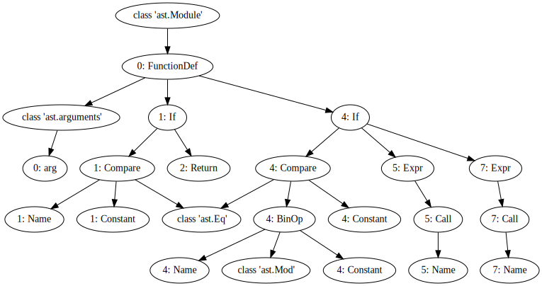
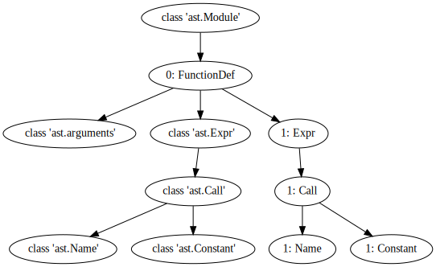
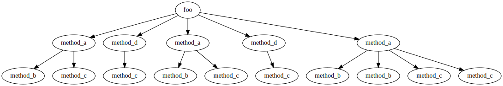
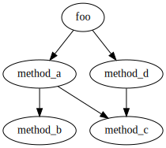
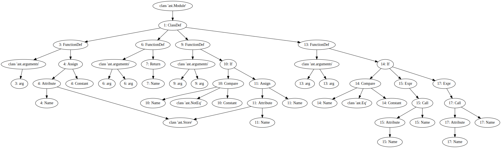

# Dynamic Analysis

In this chapter we consider dynamic analysis, which analyses a program by executing it. A dynamic analysis requires (1) program executions, i.e., tests; (2) program instrumentation that collects information at runtime in execution traces; and (3) an analysis based on the execution traces.

## Example Task: Analysing Method Calls

As an example, let's assume we want to collect information about methods called at runtime. We consider an example method `foo` which calls two other methods.


```python
def foo(x):
    if x == 0:
        return

    if x % 2 == 0:
        printEven()
    else:
        printOdd()
```


```python
def printEven():
    print("Even")
```


```python
def printOdd():
    print("Odd")
```

In contrast to previous notebooks, which used Python to analyse Java code, to enable executions in the notebook we are now analysing Python code. Let's have a look at the AST of the program we are analysing.


```python
from graphviz import Digraph
```


```python
class AstGraphGenerator(object):

    def __init__(self, source):
        self.graph = Digraph()
        self.source = source.split("\n")

    def __str__(self):
        return str(self.graph)

    def _getid(self, node):
        try:
            lineno = node.lineno - 1
            return "%d: %s" % (lineno, node.__class__.__name__)

        except AttributeError:
            return str(type(node))

    def visit(self, node):
        method = 'visit_' + node.__class__.__name__
        visitor = getattr(self, method, self.generic_visit)
        return visitor(node)
```

This implementation is crude and simplifies a couple of things, but it's sufficient to demonstrate that the Python AST is similar to the ASTs we have seen so far. 


```python
class AstGraphGenerator(AstGraphGenerator):
    def _getid(self, node):
        return str(id(node))
        
    def _getlabel(self, node):
        try:
            lineno = node.lineno - 1
            return "%d: %s" % (lineno, node.__class__.__name__)

        except AttributeError:
            return str(type(node))

        
    def generic_visit(self, node):
        self.graph.node(name=self._getid(node), label=self._getlabel(node))
        for _, value in ast.iter_fields(node):
            if isinstance(value, list):
                for item in value:
                    if isinstance(item, ast.Load):
                        continue
                    self.graph.node(name=self._getid(item), label=self._getlabel(item))
                    self.graph.edge(self._getid(node), self._getid(item))
                    if isinstance(item, ast.AST):
                        self.visit(item)

            elif isinstance(value, ast.AST):
                if isinstance(value, ast.Load):
                    return
                
                self.graph.node(name=self._getid(value), label=self._getlabel(value))
                self.graph.edge(self._getid(node), self._getid(value))
                self.visit(value)
```


```python
import inspect
```


```python
source = inspect.getsource(foo)
```


```python
print(source)
```

    def foo(x):
        if x == 0:
            return
    
        if x % 2 == 0:
            printEven()
        else:
            printOdd()
    


```python
ag = AstGraphGenerator(source)
```


```python
import ast
node = ast.parse(source)
```


```python
ag.visit(node)
```


```python
ag.graph
```


    

    


## Instrumenting the AST

Instrumentation is at the core of dynamic analysis, and one way to achieve instrumentation is by modifying the AST, and producing source code from the AST.

The Python API provides a visitor interface to manipulate Python ASTs. One way to collect information about method calls is to add instrumentation at method _entry_. We will instrument our AST such that, at the entry of every method declaration, a call to a custom method `trace` with the called method's name is inserted.


```python
class MethodEntryTransformer(ast.NodeTransformer):

    def visit_FunctionDef(self, node):
        trace_call = ast.Expr(ast.Call(func=ast.Name("trace", ast.Load()),
                        args=[ast.Constant(value=node.name)],
                        keywords=[],
                        starargs=None,
                        kwargs=None))
        node.body = [ trace_call ] + node.body
        return self.generic_visit(node)
```

Let's apply this visitor to our example program to produce a modified AST.


```python
source = inspect.getsource(printEven)
node = ast.parse(source)
node = MethodEntryTransformer().visit(node)
```


```python
ag = AstGraphGenerator(source)
ag.visit(node)
ag.graph
```


    

    


We can also produce source code from this AST. Since Python 3.9, the `ast` module provides an `unparse` method which does just that.


```python
print(ast.unparse(node))
```

    def printEven():
        trace('printEven')
        print('Even')


```python
# For Python versions < 3.9 you will need to use the astor module to produce source code from ASTs
#import astor
#print(astor.to_source(node))
```

To run our instrumented code, we need to compile the resulting program, and insert the instrumented version into Python's global map of functions.


```python
import sys
```


```python
def create_instrumented_function(f):
    source = inspect.getsource(f)
    node = ast.parse(source)
    node = MethodEntryTransformer().visit(node)

    # Make sure the line numbers are ok so that it compiles
    node = ast.fix_missing_locations(node)

    # Compile and add the instrumented function to the current module
    current_module = sys.modules[__name__]
    code = compile(node, filename="<ast>", mode="exec")
    exec(code, current_module.__dict__)
```

Let's instrument all our example methods.


```python
create_instrumented_function(printEven)
```


```python
create_instrumented_function(printOdd)
```


```python
create_instrumented_function(foo)
```

The instrumentation attempts to call a `trace` function, so we need to define one.


```python
def trace(x):
    print(f"Calling method {x}")
```

Now we can call our instrumented function and see the instrumentation in action.


```python
foo(4)
```

    Calling method foo
    Calling method printEven
    Even


## Example Analysis: Call Trees and Call Graphs

As an example analysis, let's assume we are interested in deriving call trees and call graphs from our executions. A call tree is context sensitive; a call graph is a context insensitive version of a call tree.

For this analysis, we need to track not only when we enter methods, but also when we leave them. Instrumenting this within a method is not as easy as just instrumenting entry: There can be multiple points of exit, at every return statement and for every possible exception. An alternative might be to instrument _call sites_. Let's do this an wrap each call to a method into calls to `trace_entry` and `trace_exit` functions.


```python
class MethodCallTransformer(ast.NodeTransformer):

    def visit_Expr(self, node):
        if isinstance(node.value, ast.Call):
            method_entry = ast.Expr(ast.Call(func=ast.Name("trace_entry", ast.Load()),
                        args=[ast.Constant(value=node.value.func.id)],
                        keywords=[],
                        starargs=None,
                        kwargs=None))
            method_exit = ast.Expr(ast.Call(func=ast.Name("trace_exit", ast.Load()),
                        args=[ast.Constant(value=node.value.func.id)],
                        keywords=[],
                        starargs=None,
                        kwargs=None))
            return [method_entry, node, method_exit]
```

We can again look at the resulting source code.

Since we replaced our original methods (to keep things brief), we need to redefine our code.


```python
def foo(x):
    if x == 0:
        return

    if x % 2 == 0:
        printEven()
    else:
        printOdd()
```


```python
def printEven():
    print("Even")
```


```python
def printOdd():
    print("Odd")
```


```python
source = inspect.getsource(foo)
node = ast.parse(source)
```


```python
MethodCallTransformer().visit(node)
node = ast.fix_missing_locations(node)
print(ast.unparse(node))
```

    def foo(x):
        if x == 0:
            return
        if x % 2 == 0:
            trace_entry('printEven')
            printEven()
            trace_exit('printEven')
        else:
            trace_entry('printOdd')
            printOdd()
            trace_exit('printOdd')


We also need to update our instrumentation function to make sure we use the compiled versions of our instrumented code at runtime.


```python
def create_instrumented_function(f):
    source = inspect.getsource(f)
    node = ast.parse(source)
    node = MethodCallTransformer().visit(node)
    node = ast.fix_missing_locations(node)
    current_module = sys.modules[__name__]
    code = compile(node, filename="<ast>", mode="exec")
    exec(code, current_module.__dict__)
```

We also need to define our new trace functions.


```python
def trace_entry(method):
    print(f"Entering {method}")
```


```python
def trace_exit(method):
    print(f"Leaving {method}")
```


```python
create_instrumented_function(foo)
```


```python
foo(4)
```

    Entering printEven
    Even
    Leaving printEven


```python
foo(1)
```

    Entering printOdd
    Odd
    Leaving printOdd


One thing that's missing here is the call to `foo` itself, since we called it directly rather than from some client code.

We can keep this in mind when building a proper tracer that collects the necessary information to build a call tree.


```python
class Tracer:
    def __init__(self, entry):
        self.graph = Digraph()
        self.graph.node(entry + "_1", label=entry)
        self.call_stack = [ entry + "_1" ]
        self.call_count = { entry: 1}
        
    def entry(self, method):
        if method in self.call_count:
            self.call_count[method] = self.call_count[method] + 1
        else:
            self.call_count[method] = 1
            
        node_id = f"{method}_{self.call_count[method]}"
        current_method = self.call_stack[-1]
        self.graph.node(node_id, label=method)
        self.graph.edge(current_method, node_id)
        self.call_stack.append(node_id)
        
    def exit(self, method):
        self.call_stack.pop()        
```

Our current example code does not consist of deeply nested calls, so let's include the example from the lecture slides.


```python
def foo(x):
    method_a(x)
    method_d(x)
    method_a(x)
    method_d(x)
    method_a(0)
```


```python
def method_a(x):
    method_b(x)
    if x == 0:
        method_b(x)
        
    method_c(x)
    if x == 0:
        method_c(x)
```


```python
def method_b(x):
    pass
```


```python
def method_c(x):
    pass
```


```python
def method_d(x):
    if x == 0:
        method_a(x)
    else:
        method_c(x)
```

To keep things simple, we just define a tracer as a global variable.


```python
tracer = None
```

Our tracing functions now need to make use of the `Tracer`.


```python
def trace_entry(method):
    if tracer:
        tracer.entry(method)
```


```python
def trace_exit(method):
    if tracer:
        tracer.exit(method)
```

Again we instrument all functions.


```python
create_instrumented_function(foo)
create_instrumented_function(method_a)
create_instrumented_function(method_b)
create_instrumented_function(method_c)
create_instrumented_function(method_d)
```


```python
def call_tree(method, arg):
    global tracer
    tracer = Tracer(method.__name__)
    method(arg)
    return tracer.graph
```

This gives us the following call graph.


```python
call_tree(foo, 1)
```


    

    


Simply calling the instrumented `foo` function will now use our tracer.

A call graph contains the same information, but ignores context.


```python
class CallGraphTracer:
    def __init__(self, entry):
        self.graph = Digraph()
        self.edges = set()
        self.call_stack = [ entry ]
        
    def entry(self, method):
        current_method = self.call_stack[-1]
        if not (current_method, method) in self.edges:
            self.graph.edge(current_method, method)
            self.edges.add((current_method, method))
        self.call_stack.append(method)
        
    def exit(self, method):
        self.call_stack.pop()        
```


```python
def call_graph(method, arg):
    global tracer
    tracer = CallGraphTracer(method.__name__)
    method(arg)
    return tracer.graph
```


```python
call_graph(foo, 1)
```


    

    


### Tracing

Python offers a convenient API to trace executions without instrumenting code.


```python
trace = []
```


```python
def trace_call(frame, event, arg):
    if event == "call" and not "pyenv" in frame.f_code.co_filename:
        trace.append(frame.f_code.co_name)
```

The trace function can be used with the `sys.settrace` functionality. Let's consider our original example function `foo`.


```python
def foo(x):
    if x == 0:
        return

    if x % 2 == 0:
        printEven()
    else:
        printOdd()
```

We can produce a trace by calling the `settrace` function before and after running the actual function.


```python
def foo_traced(x):
    global trace
    trace = []
    sys.settrace(trace_call)
    foo(x)
    sys.settrace(None)
```


```python
foo_traced(4)
```

    Even


Here's the calls that have been traced.


```python
trace
```


    ['foo', 'printEven']


## Example: Coverage instrumentation

Let's now look at an analysis that is more fine grained: line coverage.


```python
coverage = []
```

Using Python's tracer API, this is easy to do.


```python
def trace_lines(frame, event, arg):
    if event == 'line' and not "pyenv" in frame.f_code.co_filename:
        global coverage
        function_name = frame.f_code.co_name
        lineno = frame.f_lineno
        coverage.append(function_name +":" + str(lineno))

    return trace_lines
```

We'll again need a wrapper function that sets and unsets the tracer function.


```python
def foo_traced(x):
    global coverage
    coverage = []
    sys.settrace(trace_lines)
    foo(x)
    sys.settrace(None)
```


```python
foo_traced(4)
```

    Even


```python
coverage
```


    ['foo:2', 'foo:5', 'foo:6', 'printEven:2']


## Example: Fault Localisation

Given a test suite with at least one failing and at least one passing test case, the aim of fault localisation is to identify those statements in a program that are likely faulty. Intuitively, statements that are primarily executed by failed test cases are more likely to be faulty than those that are primarily executed by passed test cases. In spectrum-based fault localisation this is done by evaluating the similarity of each statement with the the error vector (i.e. the vector of pass/fail verdicts for each statement). There are many different competeing similarity metrics (which we will consider in more details the Software Analysis course).

The basis for fault localisation is a coverage matrix in which we have coverage information for each statement and each test case. These matrices serve to calculate several factors for each statement:

- $e_f$: Number of times the statement has been executed by failing tests.
- $e_p$: Number of times the statement has been executed by passing tests.
- $n_f$: Number of times the statement has _not_ been executed by failing tests.
- $n_p$: Number of times the statement has _not_ been executed by passing tests.

Based on these factors, different metrics to calculate the suspiciousness of a program statement have been defined, e.g.:

- Tarantula: $\frac{\frac{e_f}{e_f+n_f}}{\frac{e_p}{e_p+n_p} + \frac{e_f}{e_f+n_f}}$
- Barinel: $1 - \frac{e_p}{e_f + e_p}$
- Ochiai: $\frac{e_f}{\sqrt{(e_f + n_f) \cdot (e_f + e_p)}}$

The `middle` example function takes three parameters and should return the parameter that is the middle one when ranked by size.


```python
def middle(x, y, z):
    if y < z:
        if x < y:
            return y
        elif x < z:
            return y
    else:
        if x > y:
            return y
        elif x > z:
            return x
    return z
```


```python
middle(2, 3, 1)
```


    2


Our implementation of `middle` is buggy, which we can demonstrate by generating some tests and checking the expected values.


```python
import random
```


```python
tests = []

for i in range(10):
    x = random.randrange(10)
    y = random.randrange(10)
    z = random.randrange(10)
    m = sorted([x,y,z])[1]
    tests.append((x,y,z,m))
```

Let's check if our tests can trigger a fault, otherwise we will need to generate some more:


```python
for (x,y,z,m) in tests:
    result = middle(x,y,z)
    if result != m:
        print(f"Failed test: {x},{y},{z} == {result} but should be {m}")
```

    Failed test: 4,3,8 == 3 but should be 4


We will consider the program at the level of its lines:


```python
lines = inspect.getsource(middle).splitlines()
for i, line in enumerate(lines):
    print(f"{i}: {line}")
```

    0: def middle(x, y, z):
    1:     if y < z:
    2:         if x < y:
    3:             return y
    4:         elif x < z:
    5:             return y
    6:     else:
    7:         if x > y:
    8:             return y
    9:         elif x > z:
    10:             return x
    11:     return z


In order to apply fault localisation we need to trace test executions and keep track of which lines were executed.


```python
trace = []
```


```python
def trace_lines(frame, event, arg):
    if event == 'line' and not "pyenv" in frame.f_code.co_filename:
        global trace
        lineno = frame.f_lineno
        trace.append(lineno)

    return trace_lines
```


```python
def middle_instrumented(x,y,z):
    global trace
    sys.settrace(trace_lines)
    trace = []
    ret = middle(x,y,z)
    sys.settrace(None)
    return ret
```


```python
middle_instrumented(1,2,3)
trace
```


    [2, 3, 4]


```python
middle_instrumented(3,4,1)
trace
```


    [2, 8, 10, 11]


Now we can derive an execution spectrum for the `middle` function using our tests.


```python
import pandas as pd
```


```python
def get_spectrum(tests, statements):
    matrix = []
    for (x,y,z,m) in tests:
        row = []
        result = middle_instrumented(x,y,z)
        for lineno in statements:
            if lineno in trace:
                row.append(1)
            else:
                row.append(0)
        if result == m:
            row.append(1)
        else:
            row.append(0)
        matrix.append(row)
    
    spectrum = pd.DataFrame(matrix, columns=statements + ["Passed"])
    return spectrum
```


```python
statements = [i for i in range(len(lines))]
```


```python
spectrum = get_spectrum(tests, statements)
spectrum
```


<div>
<style scoped>
    .dataframe tbody tr th:only-of-type {
        vertical-align: middle;
    }

    .dataframe tbody tr th {
        vertical-align: top;
    }

    .dataframe thead th {
        text-align: right;
    }
</style>
<table border="1" class="dataframe">
  <thead>
    <tr style="text-align: right;">
      <th></th>
      <th>0</th>
      <th>1</th>
      <th>2</th>
      <th>3</th>
      <th>4</th>
      <th>5</th>
      <th>6</th>
      <th>7</th>
      <th>8</th>
      <th>9</th>
      <th>10</th>
      <th>11</th>
      <th>Passed</th>
    </tr>
  </thead>
  <tbody>
    <tr>
      <th>0</th>
      <td>0</td>
      <td>0</td>
      <td>1</td>
      <td>0</td>
      <td>0</td>
      <td>0</td>
      <td>0</td>
      <td>0</td>
      <td>1</td>
      <td>1</td>
      <td>0</td>
      <td>0</td>
      <td>1</td>
    </tr>
    <tr>
      <th>1</th>
      <td>0</td>
      <td>0</td>
      <td>1</td>
      <td>1</td>
      <td>0</td>
      <td>1</td>
      <td>0</td>
      <td>0</td>
      <td>0</td>
      <td>0</td>
      <td>0</td>
      <td>0</td>
      <td>1</td>
    </tr>
    <tr>
      <th>2</th>
      <td>0</td>
      <td>0</td>
      <td>1</td>
      <td>0</td>
      <td>0</td>
      <td>0</td>
      <td>0</td>
      <td>0</td>
      <td>1</td>
      <td>0</td>
      <td>1</td>
      <td>1</td>
      <td>1</td>
    </tr>
    <tr>
      <th>3</th>
      <td>0</td>
      <td>0</td>
      <td>1</td>
      <td>0</td>
      <td>0</td>
      <td>0</td>
      <td>0</td>
      <td>0</td>
      <td>1</td>
      <td>0</td>
      <td>1</td>
      <td>0</td>
      <td>1</td>
    </tr>
    <tr>
      <th>4</th>
      <td>0</td>
      <td>0</td>
      <td>1</td>
      <td>0</td>
      <td>0</td>
      <td>0</td>
      <td>0</td>
      <td>0</td>
      <td>1</td>
      <td>0</td>
      <td>1</td>
      <td>0</td>
      <td>1</td>
    </tr>
    <tr>
      <th>5</th>
      <td>0</td>
      <td>0</td>
      <td>1</td>
      <td>0</td>
      <td>0</td>
      <td>0</td>
      <td>0</td>
      <td>0</td>
      <td>1</td>
      <td>0</td>
      <td>1</td>
      <td>1</td>
      <td>1</td>
    </tr>
    <tr>
      <th>6</th>
      <td>0</td>
      <td>0</td>
      <td>1</td>
      <td>1</td>
      <td>1</td>
      <td>0</td>
      <td>0</td>
      <td>0</td>
      <td>0</td>
      <td>0</td>
      <td>0</td>
      <td>0</td>
      <td>1</td>
    </tr>
    <tr>
      <th>7</th>
      <td>0</td>
      <td>0</td>
      <td>1</td>
      <td>1</td>
      <td>1</td>
      <td>0</td>
      <td>0</td>
      <td>0</td>
      <td>0</td>
      <td>0</td>
      <td>0</td>
      <td>0</td>
      <td>1</td>
    </tr>
    <tr>
      <th>8</th>
      <td>0</td>
      <td>0</td>
      <td>1</td>
      <td>1</td>
      <td>0</td>
      <td>1</td>
      <td>1</td>
      <td>0</td>
      <td>0</td>
      <td>0</td>
      <td>0</td>
      <td>0</td>
      <td>0</td>
    </tr>
    <tr>
      <th>9</th>
      <td>0</td>
      <td>0</td>
      <td>1</td>
      <td>1</td>
      <td>0</td>
      <td>1</td>
      <td>0</td>
      <td>0</td>
      <td>0</td>
      <td>0</td>
      <td>0</td>
      <td>0</td>
      <td>1</td>
    </tr>
  </tbody>
</table>
</div>


Let's calculate Barinel using this spectrum (since it's the simplest formula).


```python
def get_suspiciousness(line, spectrum):
    
    if line not in spectrum.columns:
        return 0
    
    # Number of times the statement has been executed by failing tests.
    e_f = spectrum[(spectrum["Passed"] == 0) & (spectrum[line] == 1)].size
    
    # Number of times the statement has been executed by passing tests.
    e_p = spectrum[(spectrum["Passed"] == 1) & (spectrum[line] == 1)].size

    if e_p + e_f == 0:
        return 0
    
    suspiciousness = 1 - e_p / (e_p + e_f)
        
    return suspiciousness
```

Let's visualise the result by highlighting suspicious lines.


```python
lines = inspect.getsource(middle).splitlines()
for i in range(len(lines)):
    line = lines[i]
    suspiciousness = get_suspiciousness(i+1, spectrum)
    if suspiciousness > 0.5:
        print("\x1b[0;30;41m%2d: %s\x1b[0m" % (i, line))
    elif suspiciousness > 0.3:
        print("\x1b[0;30;43m%2d: %s\x1b[0m" % (i, line))
    else:
        print("%2d: %s" % (i, line))
    
```

     0: def middle(x, y, z):
     1:     if y < z:
     2:         if x < y:
     3:             return y
     4:         elif x < z:
     5:             return y
     6:     else:
     7:         if x > y:
     8:             return y
     9:         elif x > z:
    10:             return x
    11:     return z


## Example: Dynamic Purity Analysis

Now let's look at an analysis we could also do statically: The aim of purity analysis is to decide whether a given function has side-effects or not. We consider an object-oriented case, and try to find out if individual methods can lead to changes to attributes of the objects (=impure) or do not change the state.


```python
class Example:
    
    def __init__(self):
        self.attribute = 0
    
    def pure_method(self, x):
        return x
    
    def impure_method(self, x):
        if x != 0:
            self.attribute = x
        
    def complex_method(self, x):
        if x == 0:
            self.impure_method(x)
        else:
            self.pure_method(x)
```

Unfortunately we cannot use `inspect` to parse the source code of the class in the Jupyter notebook like we did for methods, so we'll define the source code as a string.


```python
source ="""
class Example:
    
    def __init__(self):
        self.attribute = 0
    
    def pure_method(self, x):
        return x
    
    def impure_method(self, x):
        if x != 0:
            self.attribute = x
        
    def complex_method(self, x):
        if x == 0:
            self.impure_method(x)
        else:
            self.pure_method(x)
"""
```


```python
# Doesn't work in a Jupyter notebook
#source = inspect.getsource(Example.pure_method)
```


```python
node = ast.parse(source)
```

We can look at the AST of the class as usual.


```python
ag = AstGraphGenerator(source)
ag.visit(node)
ag.graph
```


    

    


A simple static analysis could decide on purity by determining whether there is a path that reaches an attribute write operation. While this would work well for `pure_method` and `impure_method`, the `complex_method` would statically be declared impure as there is a path from `complex_method` to `impure_method` that can set the attribute. However, it is only called with argument `0` in which case the `impure_method` does _not_ set the attribute!

A simple dynamic analysis would instrument the code to track all write operations on attributes, and then can simply check if any such operations occurred in order to decide whether a function is pure or not.


```python
class PurityTransformer(ast.NodeTransformer):

    def visit_Assign(self, node):
        assignment_statements = []
        for target in node.targets:
            if isinstance(target, ast.Attribute) and isinstance(target.ctx, ast.Store):
                trace_write = ast.Expr(ast.Call(func=ast.Name("trace_write", ast.Load()),
                                args=[ast.Constant(value=target.attr)],
                                keywords=[],
                                starargs=None,
                                kwargs=None))
                assignment_statements.append(trace_write)
        
        return assignment_statements + [node]
```

Here's our instrumentation code.


```python
def create_instrumented_function(source):
    node = ast.parse(source)
    node = PurityTransformer().visit(node)

    # Make sure the line numbers are ok so that it compiles
    node = ast.fix_missing_locations(node)

    # Compile and add the instrumented function to the current module
    current_module = sys.modules[__name__]
    code = compile(node, filename="<ast>", mode="exec")
    exec(code, current_module.__dict__)
```


```python
create_instrumented_function(source)
```

Let's first just check if we the instrumentation works.


```python
def trace_write(x):
    print(f"Writing attribute: {x}")
```


```python
example = Example()
```

    Writing attribute: attribute


```python
example.pure_method(10)
```


    10


```python
example.impure_method(10)
```

    Writing attribute: attribute


```python
example.complex_method(0)
```


```python
example.complex_method(10)
```

Let's now turn this into a full analysis. Our trace function can be as simple as a Boolean that tells us whether a change has happened.


```python
pure = False
```


```python
def trace_write(x):
    global pure
    pure = False
```

The purity analysis consists of running a bunch of tests on each method, and checking this boolean. We will simply generate some random inputs for our program -- we don't need actual tests, just executions.


```python
pure = True
for i in range(1000):
    x = random.randrange(10)
    example.pure_method(x)
    if not pure:        
        break

if pure:
    print(f"Method pure_method is pure")
else:
    print(f"Method pure_method is impure")    
```

    Method pure_method is pure


```python
pure = True
for i in range(1000):
    x = random.randrange(10)
    example.impure_method(x)
    if not pure:        
        break

if pure:
    print(f"Method impure_method is pure")
else:
    print(f"Method impure_method is impure")    
```

    Method impure_method is impure


```python
pure = True
for i in range(1000):
    x = random.randrange(10)
    example.complex_method(x)
    if not pure:        
        break

if pure:
    print(f"Method complex_method is pure")
else:
    print(f"Method complex_method is impure")    
```

    Method complex_method is pure


## Delta Debugging

Since we have already considered dynamic slicing and spectrum based fault localisation, let's also look at a related automated debugging technique, which originates from Passau: Delta Debugging.

We are going to simulate the challenge of simplifying an HTML test input, based on the Mozilla bug described in the lecture. A real automated test would consist of launching the Mozilla browser and loading a page that checks if the crash still occurs. We simulate this by checking if the HTML page still contains a `<SELECT>` tag.


```python
import re
```


```python
def test(s):
    print(s, len(s))
    if re.search("<SELECT[^>]*>", s):
        return "FAIL"
    else:
        return "PASS"
```

Delta debugging is based on a binary search in the input space of our program. A binary search would split the input into two halves, and continue searching in the half that still makes the test fail.


```python
def simplify(s):
    assert test(s) == "FAIL"

    print(s, len(s))
    split = len(s)//2
    s1 = s[:split]
    s2 = s[split:]

    if test(s1) == "FAIL":
        return simplify(s1)
    if test(s2) == "FAIL":
        return simplify(s2)
    return s
```

Here's how this works.


```python
simplify('<SELECT><OPTION VALUE="simplify"><OPTION VALUE="beautify"></SELECT>')
```

    <SELECT><OPTION VALUE="simplify"><OPTION VALUE="beautify"></SELECT> 67
    <SELECT><OPTION VALUE="simplify"><OPTION VALUE="beautify"></SELECT> 67
    <SELECT><OPTION VALUE="simplify"> 33
    <SELECT><OPTION VALUE="simplify"> 33
    <SELECT><OPTION VALUE="simplify"> 33
    <SELECT><OPTION  16
    <SELECT><OPTION  16
    <SELECT><OPTION  16
    <SELECT> 8
    <SELECT> 8
    <SELECT> 8
    <SEL 4
    ECT> 4


    '<SELECT>'


But now let's try this example:


```python
simplify('<SELECT>foo</SELECT>')
```

    <SELECT>foo</SELECT> 20
    <SELECT>foo</SELECT> 20
    <SELECT>fo 10
    <SELECT>fo 10
    <SELECT>fo 10
    <SELE 5
    CT>fo 5


    '<SELECT>fo'


This input is not minimal, since the binary search has reached a point where both halves make the test pass. Delta debugging continues the binary search with increased granularity.


```python
def ddmin(s):
    assert test(s) == "FAIL"

    n = 2
    while len(s) >= 2:
        start = 0
        subset_length = len(s) // n
        some_complement_is_failing = False

        while start < len(s):
            complement = s[:start] + s[start + subset_length:]

            if test(complement) == "FAIL":
                s = complement
                n = max(n - 1, 2)
                some_complement_is_failing = True
                break
            start += subset_length

        if not some_complement_is_failing:
            if len(s) == n:
                break
            n = min(n * 2, len(s))

    return s
```


```python
ddmin('<SELECT><OPTION VALUE="simplify"><OPTION VALUE="beautify"></SELECT>')
```

    <SELECT><OPTION VALUE="simplify"><OPTION VALUE="beautify"></SELECT> 67
    <OPTION VALUE="beautify"></SELECT> 34
    <SELECT><OPTION VALUE="simplify">> 34
    ALUE="simplify">> 17
    <SELECT><OPTION V 17
    <OPTION V 9
    <SELECT>V 9
    ECT>V 5
    <SELV 5
    <SELECT> 8
    ECT> 4
    <SEL 4
    ELECT> 6
    <SECT> 6
    <SELT> 6
    <SELEC 6
    SELECT> 7
    <ELECT> 7
    <SLECT> 7
    <SEECT> 7
    <SELCT> 7
    <SELET> 7
    <SELEC> 7
    <SELECT 7


    '<SELECT>'


```python
ddmin('<SELECT>foo</SELECT>')
```

    <SELECT>foo</SELECT> 20
    o</SELECT> 10
    <SELECT>fo 10
    CT>fo 5
    <SELE 5
    ELECT>fo 8
    <SECT>fo 8
    <SELT>fo 8
    <SELECfo 8
    <SELECT> 8
    ELECT> 6
    <SECT> 6
    <SELT> 6
    <SELEC 6
    SELECT> 7
    <ELECT> 7
    <SLECT> 7
    <SEECT> 7
    <SELCT> 7
    <SELET> 7
    <SELEC> 7
    <SELECT 7
    SELECT> 7
    <ELECT> 7
    <SLECT> 7
    <SEECT> 7
    <SELCT> 7
    <SELET> 7
    <SELEC> 7
    <SELECT 7


    '<SELECT>'


