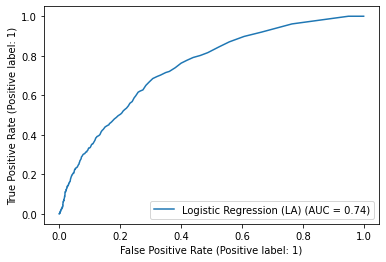
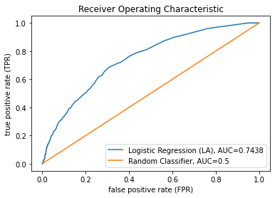
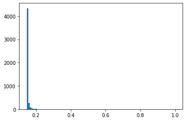
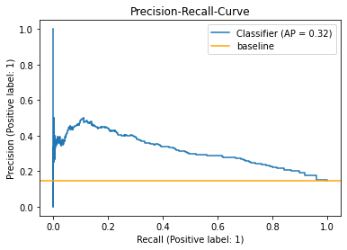

# Defect Prediction

In this chapter, we learn about the concept of defect prediction. The basic idea is to determine the probability for a release/commit to be buggy.

###  Defect Prediction


figure taken from Fan, Xia, Costa, Lo, Hassan, Li \
The Impact of Mislabeled Changes by SZZ on Just-in-Time Defect Prediction \
TSE, 2019

https://www.researchgate.net/figure/General-framework-of-Just-in-Time-JIT-defect-prediction_fig1_334553555

Defect prediction is done on different levels of abstraction.

* Just-In-Time (JIT) vs. Release-level
* commit level vs. release level prediction
* change-based or process-based metrics vs. metrics from static analysis

### Metrics


#### Types

* change-related *(ch)*
* process-related *(pr)*
* static code analysis metrics like
  - Chidamber and Kemerer 1994, "A metrics suite for object oriented design" *(ck)*
  - additional object-oriented metrics *(oo)*

#### JIT Defect Prediction

| Metric      | Description | Type |
|--|:-|--|
| NS      | The number of modified subsystems | ch |
| ND      | The number of modified directories | ch |
| NF      | The number of modified files | ch |
| Entropy | Distribution of modified code across each file | ch |
| LA      | Lines of code added | ch |
| LD      | Lines of code deleted | ch |
| LT      | Lines of code in a file before the change | ch |
| FIX     | Whether or not the change is a defect fix | ch |
| NDEV    | The number of developers that changed the modified files | pr |
| AGE     | The average time interval between the last and current change | pr |
| NUC     | The number of unique changes to the modified files | pr |
| EXP     | Developer experience | pr |
| REXP    | Recent developer experience | pr |
| SEXP    | Developer experience on a subsystem | pr |

metrics + description taken from \
Zeng, Zhengran / Zhang, Yuqun / Zhang, Haotian / Zhang, Lingming \
Deep just-in-time defect prediction: how far are we? \
ISSTA 2021

#### Release-level Defect Prediction
similar to metrics used in the domain of static analysis

| Name | Description | Type |
| -- | :- | -- |
| WMC    | Weighted method count | ck |
| DIT    | Depth of inheritance tree | ck |
| RFC    | Response for class | ck |
| NOC    | Number of children | ck |
| CBO    | Coupling between objects | ck |
| LCOM   | Lack of cohesion in methods | ck |

#### Release-level Defect Prediction
similar to metrics used in the domain of static analysis

| Name | Description | Type |
| -- | :- | -- |
| FanIn  | Number of other classes that reference the class | oo |
| FanOut | Number of other classes referenced by the class | oo |
| NOA    | Number of attributes | oo |
| NOPA   | Number of public attributes | oo |
| NOPRA  | Number of private attributes | oo |
| NOAI   | Number of attributes inherited | oo |
| LOC    | Number of lines of code | oo |
| NOM    | Number of methods | oo |
| NOPM   | Number of public methods | oo |
| NOPRM  | Number of private methods | oo |
| NOMI  | Number of methods inherited | oo |

table taken from \
D’Ambros, Lanza, Robbes \
Evaluating defect prediction approaches: a benchmark and an extensive comparison  \
Empirical Software Engineering 2012

Metrics are not necessarily used strictly for release-level or JIT defect prediction.
There are also approaches to use, for example, the second type of metrics also for JIT defect prediction [Trautsch, Herbold, Grabowski, 2020].

Modern deep learning approaches do not require manual feature engineering at all [Hoang, Kang, Lo, Lawall, 2020].

### Training Data


#### Within- vs. Cross-Project Defect Prediction


figure taken from \
Marjuni, Adji, Ferdiana \
Unsupervised software defect prediction using signed Laplacian-based spectral classifier \
Soft Computing 2019

https://www.researchgate.net/figure/Within-project-and-cross-project-defect-prediction-scenario-Nam-etal-2017_fig1_331914573

#### SZZ


figure taken from
Borg, Svensson, Berg, Hansson  
SZZ Unleashed: An Open Implementation of the SZZ Algorithm - Featuring Example Usage in a Study of Just-in-Time Bug Prediction for the Jenkins Project  
MaLTeSQuE@ESEC/SIGSOFT FSE 2019

Recent work has shown that "only about half of the commits SZZ identifies are actually bug fixing and SZZ misses about one fifth of all bug fixing commits" [Herbold2022]. Different reasons for this phenomenon may be

- tickets (issues) are not necessarily labeled correctly (might be an improvement, but labeled as bug)
- not every link from ticket (issue) to bugfix (commit) is valid (number referenced in bugfix might be ticket number, or just any other common number)
- not all of the commit identified as introducing is actually causing the bug (whitespace changes, documentation,...)
- not every bug is introduced by the code that is needed to change for fixing it
- difference between "intrinsic" and "extrinsic" bugs (extrinsic bugs are introduced by changing requirements, external libraries,... They don't have an explicit introducing commit in the production code)
- ...

In practice, this means that manual labelling would be neccessary to really improve the training data, which is expensive.

The following data/experiment is based on the replication package of \
Zeng, Zhengran / Zhang, Yuqun / Zhang, Haotian / Zhang, Lingming \
Deep just-in-time defect prediction: how far are we? \
ISSTA 2021

### Dataset Example

| # | commit id | date | bug | ns | nd | nf | entropy | la | ld | lt | fix | ndev | age | nuc | exp | rexp | sexp
| -- | -- | -- | -- | -- | -- | -- | -- | -- | -- | -- | -- | -- | -- | -- | -- | -- | -- |
|0  | 	8951b6... | 1420046511 | 0 | 1 | 1 | 1 | 0 | 2 | 2 | 1098 | 0 | 57 | 12.7706828703704 | 211 | 307 | 15.5851634074379 | 105
|1 | 	645d9e... | 1420144596 | 0 | 1 | 1 | 1 | 0 | 3 | 2 | 565 | 0 | 15 | 28.3037847222222 | 58 | 18788 | 706.767646617412 | 2607
|2 | 	032619... | 1420144601 | 0 | 1 | 1 | 1 | 0 | 1 | 2 | 238 | 0 | 11 | 132.599097222222 | 20 | 18789 | 707.767417719642 | 2607
|3 | 	05b5f4... | 1420144604 | 1 | 1 | 3 | 5 | 1.56733029467246 | 16 | 20 | 3652 | 0 | 35 | 26.9964768518519 | 654 | 18794 | 712.767245665074 | 2607
|4 | 	9a2701... | 1420144608 | 0 | 1 | 2 | 3 | 1.14883485428092 | 27 | 29 | 1234 | 0 | 23 | 65.0161458333333 | 161 | 18797 | 715.76678479794 | 2607
|5 | 	cb3f52... | 1420192546 | 0 | 1 | 1 | 4 | 1.06742926490304 | 251 | 4 | 5839 | 0  | 16 | 241.4490625 | 50 | 1472 | 61.3856478692205 | 266
|6 | 	5dd202... | 1420197074 | 0 | 1 | 1 | 2 | 0.543564443199596 | 7 | 1 | 513 | 0 | 18 | 37.5173784722222 | 55 | 1441 | 9.22531625838597 | 74
|7 | 	26b0ff... | 1420201148 | 0 | 1 | 1 | 1 | 0 | 1 | 1 | 177 | 0 | 90 | 39.8427083333333 | 295 | 17581 | 967.320548243851 | 1249
|8 | 	21b379... | 1420204547 | 0 | 1 | 1 | 1 | 0 | 0 | 16 | 525 | 1 | 13 | 133.284166666667 | 15 | 773 | 79.7507648398479 | 444
|9 | 	cd407e... | 1420207090 | 0 | 1 | 1 | 1 | 0 | 1 | 1 | 122 | 0 | 6 | 134.004722222222 | 7 | 5287 | 496.189183456316 | 1546 |
| ... | ... | ... | ... | ... | ... | ... | ... | ... | ... | ... | ... | ... | ... | ... | ... | ... | ... |


```python
import pandas as pd
import numpy as np
```


```python
data = pd.read_csv("data/qt_train.csv")
```


```python
data
```


<div>
<style scoped>
    .dataframe tbody tr th:only-of-type {
        vertical-align: middle;
    }

    .dataframe tbody tr th {
        vertical-align: top;
    }

    .dataframe thead th {
        text-align: right;
    }
</style>
<table border="1" class="dataframe">
  <thead>
    <tr style="text-align: right;">
      <th></th>
      <th>Unnamed: 0</th>
      <th>_id</th>
      <th>date</th>
      <th>bug</th>
      <th>__</th>
      <th>ns</th>
      <th>nd</th>
      <th>nf</th>
      <th>entrophy</th>
      <th>la</th>
      <th>ld</th>
      <th>lt</th>
      <th>fix</th>
      <th>ndev</th>
      <th>age</th>
      <th>nuc</th>
      <th>exp</th>
      <th>rexp</th>
      <th>sexp</th>
    </tr>
  </thead>
  <tbody>
    <tr>
      <th>0</th>
      <td>0</td>
      <td>8951b628faefdb45eb6dc87186d02397e02b68f6</td>
      <td>1420046511</td>
      <td>0</td>
      <td>0</td>
      <td>1</td>
      <td>1</td>
      <td>1</td>
      <td>0.000000</td>
      <td>2</td>
      <td>2</td>
      <td>1098</td>
      <td>0</td>
      <td>57</td>
      <td>12.770683</td>
      <td>211</td>
      <td>307</td>
      <td>15.585163</td>
      <td>105</td>
    </tr>
    <tr>
      <th>1</th>
      <td>1</td>
      <td>645d9e9632e061b26b2312d144a26fe8dc75cd1c</td>
      <td>1420144596</td>
      <td>0</td>
      <td>0</td>
      <td>1</td>
      <td>1</td>
      <td>1</td>
      <td>0.000000</td>
      <td>3</td>
      <td>2</td>
      <td>565</td>
      <td>0</td>
      <td>15</td>
      <td>28.303785</td>
      <td>58</td>
      <td>18788</td>
      <td>706.767647</td>
      <td>2607</td>
    </tr>
    <tr>
      <th>2</th>
      <td>2</td>
      <td>032619e11565743b0e607b2ad18db56cd7bd1e45</td>
      <td>1420144601</td>
      <td>0</td>
      <td>0</td>
      <td>1</td>
      <td>1</td>
      <td>1</td>
      <td>0.000000</td>
      <td>1</td>
      <td>2</td>
      <td>238</td>
      <td>0</td>
      <td>11</td>
      <td>132.599097</td>
      <td>20</td>
      <td>18789</td>
      <td>707.767418</td>
      <td>2607</td>
    </tr>
    <tr>
      <th>3</th>
      <td>3</td>
      <td>05b5f4bc16142a1e0bf6b30a8e0cefeab0c3f47b</td>
      <td>1420144604</td>
      <td>1</td>
      <td>1</td>
      <td>1</td>
      <td>3</td>
      <td>5</td>
      <td>1.567330</td>
      <td>16</td>
      <td>20</td>
      <td>3652</td>
      <td>0</td>
      <td>35</td>
      <td>26.996477</td>
      <td>654</td>
      <td>18794</td>
      <td>712.767246</td>
      <td>2607</td>
    </tr>
    <tr>
      <th>4</th>
      <td>4</td>
      <td>9a2701c1c3c7c805335fb2c1a1dfd1e712e4db6b</td>
      <td>1420144608</td>
      <td>0</td>
      <td>0</td>
      <td>1</td>
      <td>2</td>
      <td>3</td>
      <td>1.148835</td>
      <td>27</td>
      <td>29</td>
      <td>1234</td>
      <td>0</td>
      <td>23</td>
      <td>65.016146</td>
      <td>161</td>
      <td>18797</td>
      <td>715.766785</td>
      <td>2607</td>
    </tr>
    <tr>
      <th>...</th>
      <td>...</td>
      <td>...</td>
      <td>...</td>
      <td>...</td>
      <td>...</td>
      <td>...</td>
      <td>...</td>
      <td>...</td>
      <td>...</td>
      <td>...</td>
      <td>...</td>
      <td>...</td>
      <td>...</td>
      <td>...</td>
      <td>...</td>
      <td>...</td>
      <td>...</td>
      <td>...</td>
      <td>...</td>
    </tr>
    <tr>
      <th>19124</th>
      <td>19124</td>
      <td>d68c162c1b90e9e5a3d9dd4b035663ba57d3391b</td>
      <td>1491995524</td>
      <td>0</td>
      <td>0</td>
      <td>2</td>
      <td>2</td>
      <td>7</td>
      <td>1.672612</td>
      <td>94</td>
      <td>22</td>
      <td>14834</td>
      <td>0</td>
      <td>90</td>
      <td>46.002259</td>
      <td>518</td>
      <td>6110</td>
      <td>172.288072</td>
      <td>2509</td>
    </tr>
    <tr>
      <th>19125</th>
      <td>19125</td>
      <td>58a4f41af2b27957bc9dac89df21051620e3d2ec</td>
      <td>1491995529</td>
      <td>0</td>
      <td>0</td>
      <td>2</td>
      <td>5</td>
      <td>6</td>
      <td>1.542794</td>
      <td>62</td>
      <td>12</td>
      <td>7423</td>
      <td>0</td>
      <td>83</td>
      <td>167.589850</td>
      <td>374</td>
      <td>6116</td>
      <td>178.287275</td>
      <td>2509</td>
    </tr>
    <tr>
      <th>19126</th>
      <td>19126</td>
      <td>ae2329252e84a4931b321cacf529a13a3f06a0d5</td>
      <td>1491995909</td>
      <td>0</td>
      <td>0</td>
      <td>2</td>
      <td>5</td>
      <td>10</td>
      <td>2.843763</td>
      <td>25</td>
      <td>13</td>
      <td>1191</td>
      <td>0</td>
      <td>21</td>
      <td>235.612422</td>
      <td>97</td>
      <td>1170</td>
      <td>149.691136</td>
      <td>499</td>
    </tr>
    <tr>
      <th>19127</th>
      <td>19127</td>
      <td>a8570c79780fe3351ede0265eb97672bd349de99</td>
      <td>1491995943</td>
      <td>0</td>
      <td>0</td>
      <td>1</td>
      <td>1</td>
      <td>1</td>
      <td>0.000000</td>
      <td>4</td>
      <td>4</td>
      <td>118</td>
      <td>0</td>
      <td>10</td>
      <td>351.061933</td>
      <td>11</td>
      <td>1399</td>
      <td>18.972201</td>
      <td>147</td>
    </tr>
    <tr>
      <th>19128</th>
      <td>19128</td>
      <td>9c1c471e54bb12e8740b76d1c048f2f916a6ab59</td>
      <td>1491995970</td>
      <td>0</td>
      <td>0</td>
      <td>1</td>
      <td>1</td>
      <td>1</td>
      <td>0.000000</td>
      <td>50</td>
      <td>22</td>
      <td>649</td>
      <td>0</td>
      <td>31</td>
      <td>54.505764</td>
      <td>72</td>
      <td>14163</td>
      <td>440.531458</td>
      <td>87</td>
    </tr>
  </tbody>
</table>
<p>19129 rows × 19 columns</p>
</div>


```python
def drop_all_features_but_la(df):
    df = df.replace({True: 1, False: 0})
    df = df.fillna(df.mean(numeric_only=True))
    df = df[['Unnamed: 0','_id','date','bug','__'] + ['la']]
    return df.values
```


```python
data = drop_all_features_but_la(data)
```


```python
def get_ids(data):
    # return the labels of data
    return data[:, 1:2].flatten().tolist()
```


```python
def get_label(data):
    data = data[:, 3:4].flatten().tolist()
    data = [1 if int(d) > 0 else 0 for d in data]
    return data
```


```python
def get_features(data):
    # return the features of data
    return data[:, 5:]
```


```python
def load_data(path_data):
    data = pd.read_csv(path_data)
    data = drop_all_features_but_la(df=data)
    ids, labels, features = get_ids(data=data), get_label(data=data), get_features(data=data)
    indexes = list()
    cnt_noexits = 0
    for i in range(0, len(ids)):
        try:
            indexes.append(i)
        except FileNotFoundError:
            print('File commit id no exits', ids[i], cnt_noexits)
            cnt_noexits += 1
    ids = [ids[i] for i in indexes]
    labels = [labels[i] for i in indexes]
    features = features[indexes]
    return (ids, np.array(labels), features)
```


```python
# import qt dataset (80:20% split)
train, test = load_data("data/qt_train.csv"), load_data("data/qt_test.csv")
```

Here, we use within-project defect prediction (with `train` and `test` dataset both from `qt` project)

### Model


#### Examples

* Logistic Regression with manual feature engineering
* Deep Learning for (semi-) automated feature detection
  - Deep Belief Networks
  - CC2VEC with distributed vector representation based on vectors for added/removed code


```python
from sklearn import preprocessing
from sklearn.linear_model import LogisticRegression

# LApredict: logistic regression with LA (lines added) as metric
def defect_prediction_model(train, test, algorithm):
    _, Y_train, X_train = train
    _, Y_test,  X_test = test
    X_train, X_test = preprocessing.scale(X_train), preprocessing.scale(X_test)
    
    model = LogisticRegression(max_iter=7000).fit(X_train, Y_train)
    
    Y_pred = model.predict_proba(X_test)[:, 1]
    return Y_test, Y_pred
```


```python
# train LApredict on (previously imported) qt dataset
labels, predicts = defect_prediction_model(train, test, 'lr')
```


```python
from sklearn.metrics import accuracy_score, precision_score, recall_score, roc_curve, auc

def evaluation_metrics(y_true, y_pred):
    fpr, tpr, thresholds = roc_curve(y_true=y_true, y_score=y_pred, pos_label=1)
    auc_ = auc(fpr, tpr)

    y_pred = [1 if p >= 0.5 else 0 for p in y_pred]
    acc = accuracy_score(y_true=y_true, y_pred=y_pred)
    prc = precision_score(y_true=y_true, y_pred=y_pred)
    rc = recall_score(y_true=y_true, y_pred=y_pred)
    f1 = 0
    if (prc + rc) != 0:
        f1 = 2 * prc * rc / (prc + rc)
    return acc, prc, rc, f1, auc_
```


```python
acc, prc, rc, f1, auc_ = evaluation_metrics(y_true=labels, y_pred=predicts)
```


```python
auc_
```


    0.7438405440031537


cross prediction would work the same, just load

`train, test = load_data("data/cross/qt_train.csv"), load_data("data/cross/qt_test.csv")`

AUC (area under the curve) is a common metric for defect prediction performance.
"[It is ...] not as impacted by highly imbalanced data.
AUC is defined as the area under the Receiver Operating Characteristic (ROC) curve which is a plot of the false positive rate, against the true positive rate.
AUC values range from 0 to 1 with 0.5 being equivalent to random guessing and 1 being the perfect value with no false positives and every positive correctly identified."

(Trautsch et al., "Static source code metrics and static analysis warnings for fine-grained jist-in-time defect prediction", ICSME 2020)

Grafically spoken this means: if the ROC is equal (or close to) a stright line from the bottom left to the top right corner, the classification is equivalent to random guessing.
Ideally, the shape of the ROC curve goes from the bottom left to the top right corner, with a sharp curve in the top left corner.


```python
import matplotlib.pyplot as plt
from sklearn.metrics import RocCurveDisplay

RocCurveDisplay.from_predictions(labels, predicts, name="Logistic Regression (LA)")
plt.show()
```


    

    


```python
# more detailed plot with comparison

import matplotlib.pyplot as plt
from sklearn import metrics
from sklearn.metrics import roc_curve

fpr_la , tpr_la, _ = roc_curve(labels, predicts)
auc = round(metrics.roc_auc_score(labels, predicts), 4)

random_probs = [0 for _ in range(len(labels))]
random_auc = round(metrics.roc_auc_score(labels, random_probs), 4)
fpr_rand , tpr_rand, _ = roc_curve(labels, random_probs)

plt.plot(fpr_la, tpr_la, label="Logistic Regression (LA), AUC=" + str(auc))
plt.plot(fpr_rand, tpr_rand, label="Random Classifier, AUC=" + str(random_auc))
plt.legend()
plt.xlabel("false positive rate (FPR)")
plt.ylabel("true positive rate (TPR)")
plt.title('Receiver Operating Characteristic')
```


    Text(0.5, 1.0, 'Receiver Operating Characteristic')


    

    


```python
print(f"accuracy: {acc:.2f}, precision: {prc:.2f}, recall: {rc:.2f}, f1: {f1:.2f}, auc: {auc_:.4f}")
```

    accuracy: 0.85, precision: 0.33, recall: 0.00, f1: 0.01, auc: 0.7438


Considering recall (= 0.0, with AUC being 0.74), we can see why this metric alone has problems: if there are close to no positive cases (= commits with bugs), i.e. the data is highly unbalanced, suggesting no defects at all will yield a low false positive rate, thus yield relatively high AUC values while not performing any real defect prediction.


```python
_, y_train, _ = train

# Ratio of positive class in training data
unique, counts = np.unique(y_train, return_counts=True)

print("classes: " + str(unique))
print("counts: " + str(counts))

print("That is only " + str(round(counts[1] / (counts[0] + counts[1]), 4) * 100) + "% positive cases.")
```

    classes: [0 1]
    counts: [16242  2887]
    That is only 15.09% positive cases.


Therefore, the model learns to (almost) only predict the negative class:


```python
from collections import Counter

# Actual ratio of positive class for test data

print(Counter(labels))
print("actual ratio positive class: " + str(round(((Counter(labels)[1] / labels.size) * 100), 2)) + "% positive cases.")

# Predicted ratio of positive class for test data

predicts_bin_class = [1 if p >= 0.5 else 0 for p in predicts]

print(Counter(predicts_bin_class))
print("predicted ratio positive class: " + str(round(((Counter(predicts_bin_class)[1] / labels.size) * 100), 2)) + "% positive cases.")
```

    Counter({0: 4088, 1: 695})
    actual ratio positive class: 14.53% positive cases.
    Counter({0: 4774, 1: 9})
    predicted ratio positive class: 0.19% positive cases.


```python
# Predicted probabilities for test data
plt.hist(predicts, bins=100)
plt.show()
```


    

    


Another representation that may be more suitable for unbalanced datasets is precision/recall tradeoff, since precision/recall focusses on the minority class. The baseline for this representation is a horizontal line from the left to the right at hight `pos/all`, so a classifier that would always predict the positive case for all the data. Ideally, the plot would be a curve from the top left to somwhere in the middle on the right (not worse than baseline at `pos/all`), with a sharp curve in the top right corner.
Let's see how this looks for this dataset.


```python
import matplotlib.pyplot as plt
from sklearn.metrics import precision_recall_curve, PrecisionRecallDisplay

def precision_recall(y_true, y_pred):
    disp = PrecisionRecallDisplay.from_predictions(y_true, y_pred)
    plt.axhline(y=(Counter(labels)[1] / labels.size), color='orange', linestyle='-', label="baseline")
    plt.title("Precision-Recall-Curve")
    plt.legend()
    plt.show()
    
precision_recall(labels, predicts)
```


    

    


| Threshold | tp | fp | fn | Precision | Recall |
| --     | -- | -- | -- | -- | -- |
| ..     | .. | .. | .. | .. | .. |
| 0.5    | 3 | 6 | 692 | 0.3333 | 0.0043 |
| ..     | .. | .. | .. | .. | .. |
| 0.7438 | 2 | 3 | 693 | 0.4 | 0.0028 |
| 0.8634 | 2 | 2 | 693 | 0.5 | 0.0028 |
| 0.9576 | 1 | 2 | 694 | 0.3333 | 0.0014 |
| 0.9982 | 0 | 2 | 695 | 0 | 0 |
| 1      | 0 | 0 | 695 | NaN | 0 |
