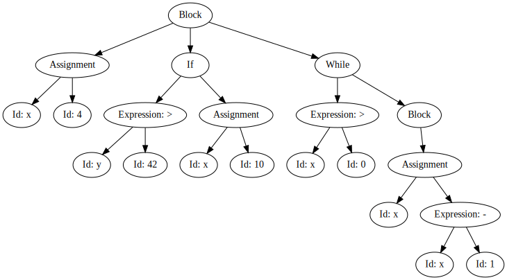
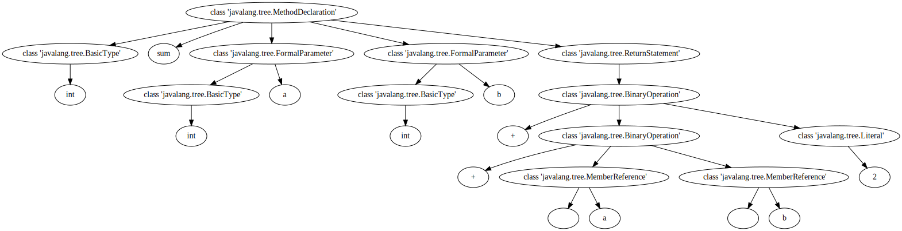

# Syntax-based Analysis (Part 2)

## Generating Parsers

In the previous chapter we built a small parser for an example language, extracted parse trees, and used syntax trees to convert source code to a format suitable for machine learning applications. Writing the parser was hard work, even though we only looked at a very simplistic language -- doing the same for "real" programming languages would be very cumbersome. Luckily, we don't need to construct parsers by hand, but can resort to compiler construction tools. We will be using [Antlr](https://www.antlr.org/) to have some parsers generated for us.

The starting point for a parser generator is a grammar describing the language, as well as lexical information that helps tokenizing raw text. In Antlr, both are specified in the same file; by convention, terminals are named in all caps and specified using regular expressions, while terminals are written in lower case.

```
grammar Expr1;

expr : expr '+' term  |
       expr '-' term  |
       term;

term : DIGIT ;

DIGIT : ('0'..'9') ;
WS : [ \t\r\n]+ -> skip ;
```

This grammar tells Antlr to skip whitespacaes (`WS`), to match individual digits (`DIGIT`), and then describes a simple grammar of expressions consisting of addition and subtraction of terms (which are simply individual digits for now).

Antlr will automatically produce a lexer and a parser and some more helpful files for us given such a grammar. To avoid a dependency on Antlr the notebook is not going to call Antlr directly, but we include the files produced by Antlr in the repository directly.

To process the above grammar with Antlr, we would need to save the grammar in a file `Expr1.g4`, and then call Antlr like so:

```
 antlr -Dlanguage=Python3 -visitor Expr1.g4
```

The `language` option tells Antlr which programming language the parser should be generated in.

The generated files are included in the `antlr` subdirectory of this notebook's repository.


```python
!ls antlr/Expr1*
```

    antlr/Expr1.g4          antlr/Expr1Lexer.interp antlr/Expr1Listener.py
    antlr/Expr1.interp      antlr/Expr1Lexer.py     antlr/Expr1Parser.py
    antlr/Expr1.tokens      antlr/Expr1Lexer.tokens antlr/Expr1Visitor.py


`Expr1Lexer.py` is the tokenizer, `Expr1Parser.py` contains the parser, `Expr1Visitor.py` provides a visitor interface for the parse tree, and `Expr1Listener.py` provides an interface with which we can react to parse events while parsing.

Since the generated files are in the `antlr` subdirectory of this notebook's repository, we need to tell Python to include from there.


```python
import sys  
sys.path.insert(0, 'antlr')

import antlr
```

We also need to include the Antlr runtime library.


```python
from antlr4 import *
```

We can now include the generated lexer and parser.


```python
from Expr1Lexer import Expr1Lexer
from Expr1Parser import Expr1Parser
```

The pipeline to parse textual input is to (1) generate an input stream based on the text, (2) create a token stream out of the input stream, and (3) invoke the parser to consume the tokens. The parsing is started by invoking the starting rule of the grammar (`expr` in our case).


```python
input = InputStream('1+2')
lexer = Expr1Lexer(input)
stream = CommonTokenStream(lexer)
parser = Expr1Parser(stream)
tree = parser.expr() 
```

The result (`tree`) is the parse tree produced by `Expr1Parser`. Antlr provides a helper function to look at the parse tree.


```python
from antlr4.tree.Trees import Trees
Trees.toStringTree(tree, None, parser)
```


    '(expr (expr (term 1)) + (term 2))'


## Translating code

We can add attributes to the terminals and nonterminals of our grammar in order to store semantic information, and we can interleave code that is executed by the parser during the parsing process. For example, if we want to convert our expressions from infix notation to postfix notation, we can simply add `print` statements at the appropriate locations.

```
grammar Expr2;

expr : expr '+' term {print("+")} |
       expr '-' term {print("-")} |
       term;

term : DIGIT {print($DIGIT.text) } ;

DIGIT : ('0'..'9') ;
WS : [ \t\r\n]+ -> skip ;
```

The resulting lexer and parser are generated by Antlr as usual, and already included in the repository, so we can immediately parse an expression and convert it to postfix notation.


```python
from Expr2Lexer import Expr2Lexer
from Expr2Parser import Expr2Parser

input = InputStream('1+2+3+4')
lexer = Expr2Lexer(input)
stream = CommonTokenStream(lexer)
parser = Expr2Parser(stream)
tree = parser.expr() 
```

    12+3+4+

Changing the language is simply a matter of updating the grammar rules, and rerunning Antlr. For example, if we want to allow our expressions to contain numbers with more than one digit, we could include a new nonterminal `number` that consists of at least one `DIGIT`.

```
grammar Expr3;

expr : expr '+' term {print("+")} |
       expr '-' term {print("-")} |
       term;

term : number  {print($number.text) } ;

number: DIGIT+;

DIGIT : ('0'..'9') ;
WS : [ \t\r\n]+ -> skip ;
```


```python
from Expr3Lexer import Expr3Lexer
from Expr3Parser import Expr3Parser

input = InputStream('12+2+443+4')
lexer = Expr3Lexer(input)
stream = CommonTokenStream(lexer)
parser = Expr3Parser(stream)
tree = parser.expr() 
```

    12 2 + 443 + 4 + 

Let's make things a bit more challenging and move from these simple expressions to program code. We'll try to parse a simple fictitious language again.


```python
example = """
begin
  x := 4;
  if y > 42 then
    x := 10;
    while x > 0 do
      begin
        x := x - 1
      end
end
"""
```

We'll start by defining the grammar for this language.

```
grammar SimpleProgram;

start : statement
      ;

statement : Identifier ':=' expr        # assignmentStatement
          | 'begin' opt_stmts 'end'     # blockStatement
          | 'if' expr 'then' statement  # ifStatement
          | 'while' expr 'do' statement # whileStatement
          ;

expr : expr op=('+' | '-' | '>') term  # binaryExpr
     | term                      # unaryExpr
     ;

term : Number
     | Identifier
     ;

opt_stmts : statement ';' opt_stmts
          | statement
          ;

Number : Digit+
       ;

Identifier : [a-zA-Z_] [a-zA-Z_0-9]*
           ;

Digit : ('0'..'9') ;
WS : [ \t\r\n]+ -> skip ;
```


```python
from SimpleProgramLexer import SimpleProgramLexer
from SimpleProgramParser import SimpleProgramParser

input = InputStream(example)
lexer = SimpleProgramLexer(input)
stream = CommonTokenStream(lexer)
parser = SimpleProgramParser(stream)
tree = parser.start() 
```


```python
Trees.toStringTree(tree, None, parser)
```


    '(start (statement begin (opt_stmts (statement x := (expr (term 4))) ; (opt_stmts (statement if (expr (expr (term y)) > (term 42)) then (statement x := (expr (term 10)))) ; (opt_stmts (statement while (expr (expr (term x)) > (term 0)) do (statement begin (opt_stmts (statement x := (expr (expr (term x)) - (term 1)))) end))))) end))'


The translation from infix expressions to postfix expressions we did earlier is actually quite similar to the translation from Java source code to Java byte code. Java uses a stack machine, where all operations are performed with regards to an operand stack; thus, similar to a postfix subtraction an operation would take as many operands as it needs from the stack, performs the operation, and pushes the result back on the stack.

To represent our simple program in a bytecode-like notation, we define the following bytecode instructions:
- `HALT`: End of execution
- `LVALUE`: Load variable onto the stack
- `RVALUE`: Store top of stack in a local variable
- `LABEL`: Denote a location as jump target
- `GOTO`: Unconditional jump to target label
- `GOFALSE`: If top of stack represents the value false, then jump to target label
- `IADD`: Pop the top two operands from the stack, push result of addition back to stack
- `ISUB`: Pop the top two operands from the stack, push result of subtraction back to stack
- `CMPGT`: Pop the top two operands from the stack, apply numerical comparison and push integer (0/1) with result back to stack.

The following annotated version of the grammar prints out a bytecode version of the program, in the same way that our annotated grammar converted infix to postfix notation expressions.

```
grammar Expr4;

start : {self.unique_id=10000} statement {
print("HALT") }
      ;

statement : Identifier ':=' expr  {print("LVALUE "+$Identifier.text) }
          | 'begin' opt_stmts 'end'
          | 'if' expr 'then' {
label = str(self.unique_id)
self.unique_id += 1
print("GOFALSE "+label)
          } statement {print("LABEL "+label)
          }
          | 'while' {
label1 = str(self.unique_id)
self.unique_id += 1
label2 = str(self.unique_id)
self.unique_id += 1
print("LABEL "+label1)
                       }
                       expr {
print("GOFALSE "+label2)
                       }
                      'do' statement {
print("GOTO "+label1)
print("LABEL "+label2)
                       }
          ;

expr : expr '+' term {print("IADD") }
     | expr '-' term {print("ISUB") }
     | expr '>' term  {print("CMPGT") }
     | term
     ;
     
term : Number  {print("PUSH "+$Number.text) }
     | Identifier  {print("RVALUE "+$Identifier.text) }
     ;

opt_stmts : statement ';' opt_stmts
          | statement
          ;

Number : Digit+
       ;

Identifier : [a-zA-Z_] [a-zA-Z_0-9]*
           ;

Digit : ('0'..'9') ;
WS : [ \t\r\n]+ -> skip ;
```

As in the other cases the result of running Antlr on this grammar are already in the repository, so we can immidately try to parse the `example` code.


```python
from Expr4Lexer import Expr4Lexer
from Expr4Parser import Expr4Parser

input = InputStream(example)
lexer = Expr4Lexer(input)
stream = CommonTokenStream(lexer)
parser = Expr4Parser(stream)
tree = parser.start() 
```

    PUSH 4
    LVALUE x
    RVALUE y
    PUSH 42
    CMPGT
    GOFALSE 10000
    PUSH 10
    LVALUE x
    LABEL 10000
    LABEL 10001
    RVALUE x
    PUSH 0
    CMPGT
    GOFALSE 10002
    RVALUE x
    PUSH 1
    ISUB
    LVALUE x
    GOTO 10001
    LABEL 10002
    HALT


Our goal actually isn't compilation, but we are considering all this to understand where the Abstract Syntax Tree comes from. The datastructure that Antlr gives us is the raw parse tree, which we could interpret as a _concrete_ parse tree. To create an abstract syntax tree, we need to decide on the abstraction, and create a class hierarchy.


```python
node_id = 0

class ASTNode:
    def __init__(self, name, children = []):
        global node_id
        self.children = children
        self.name = name
        self.id = node_id
        node_id += 1
        
    def get_label(self):
        return self.name
    
    def get_id(self):
        return str(self.id)
```

We need a unique ID for each node in order to visualize the resulting tree with GraphViz; the graph should show a more readable label for each node (`get_label`). We also need the nodes to be aware of their children, such that we can traverse the tree structure.


```python
class Number(ASTNode):
    def __init__(self, num):
        self.number = num
        super().__init__("Number")
```


```python
class Identifier(ASTNode):
    def __init__(self, name):
        self.identifier = name
        super().__init__("Identifier")  
        
    def get_label(self):
        return "Id: "+str(self.identifier)
```


```python
class AssignmentStatement(ASTNode):
    def __init__(self, identifier, expression):
        self.identifier = identifier
        self.expression = expression
        super().__init__("Assignment", [identifier, expression])        
```


```python
class BlockStatement(ASTNode):
    def __init__(self, statements):
        self.statements = statements
        super().__init__("Block", statements )
```

The `BlockStatement` is an example where we are abstracting: The corresponsing node in the concrete syntax tree will be a `Statement` node with three children, the terminals `begin` and `end`, which are irrelevant in our abstraction, and the `opt_stmts`, which is an unnecessary indirection we can avoid by directly adding the statements as children of `BlockStatement`.


```python
class Expression(ASTNode):
    def __init__(self, lhs, rhs, op):
        self.lhs = lhs
        self.rhs = rhs
        self.op  = op
        super().__init__("Expression", [lhs, rhs])
        
    def get_label(self):
        return "Expression: "+str(self.op)
```


```python
class IfStatement(ASTNode):
    def __init__(self, expr, then):
        self.expr = expr
        self.then = then
        super().__init__("If", [expr, then])
```


```python
class WhileStatement(ASTNode):
    def __init__(self, expr, body):
        self.expr = expr
        self.body = body
        super().__init__("While", [expr, body])
```

One way of creating the AST is by visiting the concrete syntax tree and instantiating appropriate nodes. Antlr has already produced a visitor interface for our `SimpleProgram` grammar.


```python
from SimpleProgramVisitor import SimpleProgramVisitor
```


```python
class ASTBuilder(SimpleProgramVisitor):
    def visitStart(self, ctx:SimpleProgramParser.StartContext):
        return self.visit(ctx.statement())
    
    def visitAssignmentStatement(self, ctx):        
        return AssignmentStatement(Identifier(ctx.Identifier()), self.visit(ctx.expr()))
    
    def visitBlockStatement(self, ctx):
        return BlockStatement(self.visit(ctx.opt_stmts()))
    
    def visitIfStatement(self, ctx):
        return IfStatement(self.visit(ctx.expr()), self.visit(ctx.statement()))

    def visitWhileStatement(self, ctx):
        return WhileStatement(self.visit(ctx.expr()), self.visit(ctx.statement()))
    
    def visitUnaryExpr(self, ctx):
        return self.visitTerm(ctx.term())

    def visitBinaryExpr(self, ctx):
        return Expression(self.visit(ctx.expr()), self.visit(ctx.term()), ctx.op.text)

    def visitTerm(self, ctx):
        if ctx.getAltNumber() == 0:
            return Identifier(ctx.getChild(0).getText())
        else:
            return Number(ctx.getChild(0).getText())

    def visitOpt_stmts(self, ctx):
        statements = []
        statements.append(self.visit(ctx.statement()))
        if ctx.getChildCount() > 1:
            remaining_stmts = self.visitOpt_stmts(ctx.opt_stmts())
            statements.extend(remaining_stmts)
        return statements
```

Let's use our non-translating parser for the `SimpleProgram` grammar again.


```python
input = InputStream(example)
lexer = SimpleProgramLexer(input)
stream = CommonTokenStream(lexer)
parser = SimpleProgramParser(stream)
tree = parser.start() 
```

To create our AST, we just need to apply the visitor.


```python
builder = ASTBuilder()
```


```python
tree.accept(builder)
```


    <__main__.BlockStatement at 0x10e17e550>


...which of course doesn't tell us anything useful since we have not defined a string representation. Let's rather visualise the tree directly.


```python
from graphviz import Digraph
def print_tree(tree, dot = Digraph()):

    dot.node(tree.get_id(), tree.get_label())
        
    for child in tree.children:
        dot.edge(tree.get_id(), child.get_id())
        print_tree(child, dot)
            
                 
    return dot
```


```python
print_tree(tree.accept(builder))
```


    

    


Of course we could also integrate the AST Node creation directly in the attributed grammar.

```
grammar SimpleProgramAttributed;

start returns [node]
      : statement {$node = $statement.node }
      ;

statement returns [node]
          : Identifier ':=' expr        {$node = AssignmentStatement(Identifier($Identifier.text), $expr.node) }
          | 'begin' opt_stmts 'end'     {$node = BlockStatement($opt_stmts.nodes) }
          | 'if' a=expr 'then' statement  {$node = IfStatement($a.node, $statement.node) }
          | 'while' a=expr 'do' statement {$node = WhileStatement($a.node, $statement.node) }
          ;

expr returns [node]
     : a=expr op=('+' | '-' | '>') term  {$node = Expression($a.node, $term.node, $op.text) }
     | term                            {$node = $term.node }
     ;

term returns [node]
     : Number      {$node = Number($Number.text) }
     | Identifier  {$node = Identifier($Identifier.text) }
     ;

opt_stmts returns [nodes]
          : statement ';' opt_stmts  {$nodes = [ $statement.node] + $opt_stmts.nodes }
          | statement                {$nodes = [ $statement.node] }
          ;

Number : Digit+
       ;

Identifier : [a-zA-Z_] [a-zA-Z_0-9]*
           ;

Digit : ('0'..'9') ;
WS : [ \t\r\n]+ -> skip ;
```

## Linting

The first application of ASTs we looked at last week was to create embeddings from source code. However, the AST is immediately useful also without any machine learning. A common application of ASTs is linting, i.e., checking the AST whether it satisfies certain syntactic rules and whether it matches known patterns of problems. For example, many of the checks that [SpotBugs performs](https://spotbugs.readthedocs.io/en/latest/bugDescriptions.html) are based on the AST.

Let's use some Java code snippets for our analysis.


```python
code1 = """
public class Foo {
  public void foo(int x) {
    System.out.println("Hello Clone!");
    int j = 10;
    for(int i = 0; i < x; i++) {
      System.out.println("Another iteration");
    }
  }
}
"""
```


```python
code2 = """
public class Foo {
  public void foo(int x) { System.out.println("This is a very long line for the sake of the check")}
}
"""
```

We'll start by implementing some checks that we can apply directly at the character level. For example, [Checkstyle](https://checkstyle.sourceforge.io/config_sizes.html#FileLength) contains rules to check whether a maximum allowed number of lines is exceeded by a source code file, or if a maximum line length is exceeded.


```python
class FileChecker:
    def check(self, code):
        lines = code.split('\n')
        return self.checkLines(lines)
```


```python
class FileLengthChecker(FileChecker):
    def __init__(self):
        self.max_length = 6 # Extra small for example
        
    def checkLines(self, lines):
        return len(lines) > self.max_length
```


```python
class LineLengthChecker(FileChecker):
    def __init__(self):
        self.max_length = 50 # Extra small for example
        
    def checkLines(self, lines):
        long_lines = [line for line in lines if len(line) > self.max_length]
        return len(long_lines) > 0
```

The first code example is longer than allowed.


```python
FileLengthChecker().check(code1)
```


    True


The second one isn't.


```python
FileLengthChecker().check(code2)
```


    False


The first contains only short lines.


```python
LineLengthChecker().check(code1)
```


    False


The second one contains a very long line.


```python
LineLengthChecker().check(code2)
```


    True


To extend these basic checks to more complicated syntactical checks, we will use the javalang parser again.


```python
import javalang
```


```python
class ASTChecker:
    def check(self, code):
        self.tree = javalang.parse.parse(code)
        return self.check_ast(self.tree)
```

For example, let's consider the SpotBugs check for [Covariant equals methods](https://spotbugs.readthedocs.io/en/latest/bugDescriptions.html#eq-covariant-equals-method-defined-eq-self-no-object). That is, if there is a method named equals that has a different signature than the one inherited from `java.lang.Object` then this is suspicious code.


```python
class CovariantEqualsChecker(ASTChecker):
    def __init__(self):
        self.max_length = 50
        
    def check_ast(self, ast):
        for _, node in ast.filter(javalang.tree.MethodDeclaration):
            if node.name == "equals":
                if len(node.parameters) != 1:
                    return True
                if node.parameters[0].type.name != "Object":
                    return True
        return False
```


```python
code3 = """
public class Foo {
  public boolean equals(String str) {
    return true;
  }
}
"""
```


```python
CovariantEqualsChecker().check(code1)
```


    False


```python
CovariantEqualsChecker().check(code3)
```


    True


As another AST example, let's consider the [Format String Newline](https://spotbugs.readthedocs.io/en/latest/bugDescriptions.html#fs-format-string-should-use-n-rather-than-n-va-format-string-uses-newline) check in SpotBugs. The problem matched by this check is whether a formatting string, used in the static method `String.format`, contains an explicit newline character (`\n`) rather than using the correct newline formatting string (`%n`).


```python
code4 = """
public class Foo {
  public void foo(String str) {
    String foo = String.format("Foo\n");
    System.out.println(foo);
  }
}
"""
```


```python
class FormatStringNewlineChecker(ASTChecker):
    def __init__(self):
        self.max_length = 50
        
    def check_ast(self, ast):
        for _, node in ast.filter(javalang.tree.MethodInvocation):            
            if node.member == "format" and \
                len(node.arguments) >= 1 and \
                node.qualifier == "String":
                if "\n" in node.arguments[0].value:
                    return True

        return False
```


```python
FormatStringNewlineChecker().check(code1)
```


    False


```python
FormatStringNewlineChecker().check(code4)
```


    True


As last example, consider the [Useless control flow](https://spotbugs.readthedocs.io/en/latest/bugDescriptions.html#ucf-useless-control-flow-ucf-useless-control-flow) checker: This describes an if-statement that has no effects since the then-block is empty.


```python
code5 = """
public class Foo {
  public boolean foo(int x) {
    if (x > 0) {
    
    }
    System.out.println("Foo");
  }
}
"""
```


```python
class UselessControlFlowChecker(ASTChecker):
    def __init__(self):
        self.max_length = 50
        
    def check_ast(self, ast):
        for _, node in ast.filter(javalang.tree.IfStatement):
            if isinstance(node.then_statement, javalang.tree.BlockStatement):
                if not node.then_statement.statements:
                    return True

        return False
```


```python
UselessControlFlowChecker().check(code1)
```


    False


```python
UselessControlFlowChecker().check(code5)
```


    True


```python
code6 = """
public class Foo {
  public Boolean foo(int x) {
    return null;
  }
}
"""
```


```python
class BooleanReturnNullChecker(ASTChecker):
    def __init__(self):
        self.max_length = 50
        
    def check_ast(self, ast):
        for _, node in ast.filter(javalang.tree.MethodDeclaration):
            if node.return_type and node.return_type.name == "Boolean":
                for _, return_stmt in ast.filter(javalang.tree.ReturnStatement):
                    expr = return_stmt.expression
                    if type(expr) == javalang.tree.Literal and expr.value == "null":
                            return True

        return False
```


```python
BooleanReturnNullChecker().check(code1)
```


    False


```python
BooleanReturnNullChecker().check(code6)
```


    True


## Code2vec

Although we've already covered the ASTNN approach for creating code embeddings, we will now also consider an alternative approach, which has contributed much to the general idea of code embeddings in the first place:

Alon, U., Zilberstein, M., Levy, O., & Yahav, E. (2019). code2vec: Learning distributed representations of code. Proceedings of the ACM on Programming Languages, 3(POPL), 1-29.

We will look at how to embed an individual method using code2vec. For this, let's define a simple helper function that gives us an AST rooted at a method declaration.


```python
code = """
public int sum(int a, int b) {
   return a + b + 2;
}
"""
```


```python
import javalang
```


```python
def parse_method(code):
    class_code = "class Dummy {\n" + code + "\n}";
    tokens = javalang.tokenizer.tokenize(class_code)
    parser = javalang.parser.Parser(tokens)
    ast = parser.parse()
    _, node = list(ast.filter(javalang.tree.MethodDeclaration))[0]
    return node
```


```python
tree = parse_method(code)
```


```python
tree
```


    MethodDeclaration(annotations=[], body=[ReturnStatement(expression=BinaryOperation(operandl=BinaryOperation(operandl=MemberReference(member=a, postfix_operators=[], prefix_operators=[], qualifier=, selectors=[]), operandr=MemberReference(member=b, postfix_operators=[], prefix_operators=[], qualifier=, selectors=[]), operator=+), operandr=Literal(postfix_operators=[], prefix_operators=[], qualifier=None, selectors=[], value=2), operator=+), label=None)], documentation=None, modifiers={'public'}, name=sum, parameters=[FormalParameter(annotations=[], modifiers=set(), name=a, type=BasicType(dimensions=[], name=int), varargs=False), FormalParameter(annotations=[], modifiers=set(), name=b, type=BasicType(dimensions=[], name=int), varargs=False)], return_type=BasicType(dimensions=[], name=int), throws=None, type_parameters=None)


```python
from graphviz import Digraph
def print_tree(tree):
    unique_id = 1
    dot = Digraph()
    for path, node in tree:
        dot.node(str(id(node)), str(type(node)))
        
        for child in node.children:
            if isinstance(child, javalang.ast.Node):
                dot.edge(str(id(node)), str(id(child)))
            elif type(child) == str:
                strid = str(unique_id)
                unique_id = unique_id + 1
                dot.node(strid, child)
                dot.edge(str(id(node)), strid)
            elif type(child) == list:
                for lc in child:
                    dot.edge(str(id(node)), str(id(lc)))
                 
    return dot
```


```python
print_tree(tree)
```


    

    


In contrast to ASTNN with its statement trees, code2vec looks at the concept of a path context, which is a path between two tokens in the AST.

We can easily retrieve a list of all terminals in the AST; for example we could traverse the tree and look for strings or sets.


```python
for path, node in tree:
    for child in node.children:
        if child:
            if type(child) is str:
                print("Terminal: ", child)
            elif type(child) is set:
                for x in child:
                    print("Terminal ", x)
        
        
```

    Terminal  public
    Terminal:  sum
    Terminal:  int
    Terminal:  a
    Terminal:  int
    Terminal:  b
    Terminal:  int
    Terminal:  +
    Terminal:  +
    Terminal:  a
    Terminal:  b
    Terminal:  2


Let's put this into a function that gives us the terminals as well as the corresponding AST nodes.


```python
def get_terminal_nodes(tree):
    for path, node in tree:
        for child in node.children:
            if child:
                if type(child) is str and child != "Dummy":
                    yield(node, child)
                elif type(child) is set:
                    for x in child:
                        yield(node, x)      
```


```python
[ terminal for _, terminal in list(get_terminal_nodes(tree))]
```


    ['public', 'sum', 'int', 'a', 'int', 'b', 'int', '+', '+', 'a', 'b', '2']


A path context is defined as the path between two terminals, so let's pick to two terminals.


```python
node1, terminal1 = list(get_terminal_nodes(tree))[-1]
node2, terminal2 = list(get_terminal_nodes(tree))[-2]
```


```python
terminal1
```


    '2'


```python
terminal2
```


    'b'


Let's first construct the path from a root node to a chosen terminal node.


```python
def get_path(tree, node):
    if tree == node:
        return [tree]
    
    if type(tree) == list:
        for child in tree:
            path = get_path(child, node)
            if path:
                return path  
    
    if not isinstance(tree, javalang.tree.Node):
        return None
    
    for child in tree.children:
        path = get_path(child, node)
        if path:
            return [tree] + path  
    
    return None
```


```python
def print_path(path):
    result = ""
    for node in path:
        if type(node) == str:
            result += node
        elif type(node) == list:
            result += print_path(node)
        else:
            result += str(type(node))

    return result
```


```python
print_path(get_path(tree, node1))
```


    "<class 'javalang.tree.MethodDeclaration'><class 'javalang.tree.ReturnStatement'><class 'javalang.tree.BinaryOperation'><class 'javalang.tree.Literal'>"


```python
print_path(get_path(tree, node2))
```


    "<class 'javalang.tree.MethodDeclaration'><class 'javalang.tree.ReturnStatement'><class 'javalang.tree.BinaryOperation'><class 'javalang.tree.BinaryOperation'><class 'javalang.tree.MemberReference'>"


A path context consists of the path up the AST from the first terminal node to the least common ancestor of both terminal nodes, and then down the AST again to the second terminal node.


```python
def path_context(tree, node1, node2):
    path1 = get_path(tree, node2)
    path1.reverse()
    for i in range(len(path1)):
        node = path1[i]
        path2 = get_path(node, node1)
        if path2:
            return (path1[:i], path2)
```


```python
def print_path_context(path_context):
    down_path = []
    up_path = []
    for node in path_context[0]:
        if type(node) == str:
            up_path.append(node)
        else:
            up_path.append(node.__class__.__name__)
    for node in path_context[1]:
        if type(node) == str:
            down_path.append(node)
        else:
            down_path.append(node.__class__.__name__)
            
    return "↑".join(up_path) + "↑" + "↓".join(down_path)
```


```python
print_path_context(path_context(tree, node1, node2))
```


    'MemberReference↑BinaryOperation↑BinaryOperation↓Literal'


```python
print_path_context(path_context(tree, node2, node1))
```


    'Literal↑BinaryOperation↓BinaryOperation↓MemberReference'


```python
terminal1
```


    '2'


```python
terminal2
```


    'b'


To build the embeddings for a method, we next require the path context for every pair of terminal nodes in the AST.


```python
terminals = list(get_terminal_nodes(tree))
paths = []
for index1 in range(len(terminals)-1):
    node1, terminal1 = terminals[index1]
    for index2 in range(index1 + 1, len(terminals)):
        node2, terminal2 = terminals[index2]
        path = path_context(tree, node1, node2)
        print(terminal1, ",", print_path_context(path), ",", terminal2)
        paths.append(path)
len(paths)
```

    public , ↑MethodDeclaration , sum
    public , BasicType↑MethodDeclaration , int
    public , FormalParameter↑MethodDeclaration , a
    public , BasicType↑FormalParameter↑MethodDeclaration , int
    public , FormalParameter↑MethodDeclaration , b
    public , BasicType↑FormalParameter↑MethodDeclaration , int
    public , BinaryOperation↑ReturnStatement↑MethodDeclaration , +
    public , BinaryOperation↑BinaryOperation↑ReturnStatement↑MethodDeclaration , +
    public , MemberReference↑BinaryOperation↑BinaryOperation↑ReturnStatement↑MethodDeclaration , a
    public , MemberReference↑BinaryOperation↑BinaryOperation↑ReturnStatement↑MethodDeclaration , b
    public , Literal↑BinaryOperation↑ReturnStatement↑MethodDeclaration , 2
    sum , BasicType↑MethodDeclaration , int
    sum , FormalParameter↑MethodDeclaration , a
    sum , BasicType↑FormalParameter↑MethodDeclaration , int
    sum , FormalParameter↑MethodDeclaration , b
    sum , BasicType↑FormalParameter↑MethodDeclaration , int
    sum , BinaryOperation↑ReturnStatement↑MethodDeclaration , +
    sum , BinaryOperation↑BinaryOperation↑ReturnStatement↑MethodDeclaration , +
    sum , MemberReference↑BinaryOperation↑BinaryOperation↑ReturnStatement↑MethodDeclaration , a
    sum , MemberReference↑BinaryOperation↑BinaryOperation↑ReturnStatement↑MethodDeclaration , b
    sum , Literal↑BinaryOperation↑ReturnStatement↑MethodDeclaration , 2
    int , FormalParameter↑MethodDeclaration↓BasicType , a
    int , BasicType↑FormalParameter↑MethodDeclaration↓BasicType , int
    int , FormalParameter↑MethodDeclaration↓BasicType , b
    int , BasicType↑FormalParameter↑MethodDeclaration↓BasicType , int
    int , BinaryOperation↑ReturnStatement↑MethodDeclaration↓BasicType , +
    int , BinaryOperation↑BinaryOperation↑ReturnStatement↑MethodDeclaration↓BasicType , +
    int , MemberReference↑BinaryOperation↑BinaryOperation↑ReturnStatement↑MethodDeclaration↓BasicType , a
    int , MemberReference↑BinaryOperation↑BinaryOperation↑ReturnStatement↑MethodDeclaration↓BasicType , b
    int , Literal↑BinaryOperation↑ReturnStatement↑MethodDeclaration↓BasicType , 2
    a , BasicType↑FormalParameter , int
    a , FormalParameter↑MethodDeclaration↓FormalParameter , b
    a , BasicType↑FormalParameter↑MethodDeclaration↓FormalParameter , int
    a , BinaryOperation↑ReturnStatement↑MethodDeclaration↓FormalParameter , +
    a , BinaryOperation↑BinaryOperation↑ReturnStatement↑MethodDeclaration↓FormalParameter , +
    a , MemberReference↑BinaryOperation↑BinaryOperation↑ReturnStatement↑MethodDeclaration↓FormalParameter , a
    a , MemberReference↑BinaryOperation↑BinaryOperation↑ReturnStatement↑MethodDeclaration↓FormalParameter , b
    a , Literal↑BinaryOperation↑ReturnStatement↑MethodDeclaration↓FormalParameter , 2
    int , FormalParameter↑MethodDeclaration↓FormalParameter↓BasicType , b
    int , BasicType↑FormalParameter↑MethodDeclaration↓FormalParameter↓BasicType , int
    int , BinaryOperation↑ReturnStatement↑MethodDeclaration↓FormalParameter↓BasicType , +
    int , BinaryOperation↑BinaryOperation↑ReturnStatement↑MethodDeclaration↓FormalParameter↓BasicType , +
    int , MemberReference↑BinaryOperation↑BinaryOperation↑ReturnStatement↑MethodDeclaration↓FormalParameter↓BasicType , a
    int , MemberReference↑BinaryOperation↑BinaryOperation↑ReturnStatement↑MethodDeclaration↓FormalParameter↓BasicType , b
    int , Literal↑BinaryOperation↑ReturnStatement↑MethodDeclaration↓FormalParameter↓BasicType , 2
    b , BasicType↑FormalParameter , int
    b , BinaryOperation↑ReturnStatement↑MethodDeclaration↓FormalParameter , +
    b , BinaryOperation↑BinaryOperation↑ReturnStatement↑MethodDeclaration↓FormalParameter , +
    b , MemberReference↑BinaryOperation↑BinaryOperation↑ReturnStatement↑MethodDeclaration↓FormalParameter , a
    b , MemberReference↑BinaryOperation↑BinaryOperation↑ReturnStatement↑MethodDeclaration↓FormalParameter , b
    b , Literal↑BinaryOperation↑ReturnStatement↑MethodDeclaration↓FormalParameter , 2
    int , BinaryOperation↑ReturnStatement↑MethodDeclaration↓FormalParameter↓BasicType , +
    int , BinaryOperation↑BinaryOperation↑ReturnStatement↑MethodDeclaration↓FormalParameter↓BasicType , +
    int , MemberReference↑BinaryOperation↑BinaryOperation↑ReturnStatement↑MethodDeclaration↓FormalParameter↓BasicType , a
    int , MemberReference↑BinaryOperation↑BinaryOperation↑ReturnStatement↑MethodDeclaration↓FormalParameter↓BasicType , b
    int , Literal↑BinaryOperation↑ReturnStatement↑MethodDeclaration↓FormalParameter↓BasicType , 2
    + , BinaryOperation↑BinaryOperation , +
    + , MemberReference↑BinaryOperation↑BinaryOperation , a
    + , MemberReference↑BinaryOperation↑BinaryOperation , b
    + , Literal↑BinaryOperation , 2
    + , MemberReference↑BinaryOperation , a
    + , MemberReference↑BinaryOperation , b
    + , Literal↑BinaryOperation↓BinaryOperation , 2
    a , MemberReference↑BinaryOperation↓MemberReference , b
    a , Literal↑BinaryOperation↓BinaryOperation↓MemberReference , 2
    b , Literal↑BinaryOperation↓BinaryOperation↓MemberReference , 2


    66


Converting a function to a path context


```python
method1 = """
public int sum(int a, int b) {
   return a + b + 2;
}
"""
```


```python
method2 = """
public void printHello(String name) {
   System.out.println("Hello " + name +"! ");
}
"""
```


```python
method3 = """
public boolean isTheAnswer(int x) {
   if (x == 42) {
     return true;
   } else {
     return false;
   }
}
"""
```


```python
def get_method_name(tree):
    for _, node in tree.filter(javalang.tree.MethodDeclaration):
        return node.name
    return None
```


```python
def get_id(value, dictionary, vocab):
    if value in dictionary:
        return dictionary[value]
    else:
        new_id = len(dictionary.keys())
        dictionary[value] = new_id
        vocab[new_id] = value
    return new_id
```


```python
from dataclasses import dataclass

# collection of all known paths, terminals, and method names in the dataset
@dataclass
class Vocabulary:
    # actual type of the value is not important, put in whatever is best
    paths: dict[int, str]
    terminals: dict[int, str]
    method_names: dict[int, str]

vocabulary = Vocabulary({}, {}, {})
```


```python
train_x = []
train_y = []

paths = {}
method_names = {}
terminal_names = {}

for method in [method1, method2, method3]:
    method_ast = parse_method(method)
    name = get_method_name(method_ast)    
    method_id = get_id(name, method_names, vocabulary.method_names)
    path_contexts = []
    
    terminals = list(get_terminal_nodes(method_ast))
    for index1 in range(len(terminals)-1):
        node1, terminal1 = terminals[index1]
        terminal1_id = get_id(terminal1, terminal_names, vocabulary.terminals)
        for index2 in range(index1 + 1, len(terminals)):
            node2, terminal2 = terminals[index2]
            terminal2_id = get_id(terminal2, terminal_names, vocabulary.terminals)
            path = path_context(method_ast, node1, node2)
            path_str = print_path_context(path)
            path_id = get_id(path_str, paths, vocabulary.paths)
            print(terminal1, ",", path_str, ",", terminal2)
            print(terminal1_id, ",", path_id, ",", terminal2_id)
            path_contexts.append((terminal1_id, path_id, terminal2_id))
            
    train_x.append(path_contexts)
    train_y.append(method_id)
```

    public , ↑MethodDeclaration , sum
    0 , 0 , 1
    public , BasicType↑MethodDeclaration , int
    0 , 1 , 2
    public , FormalParameter↑MethodDeclaration , a
    0 , 2 , 3
    public , BasicType↑FormalParameter↑MethodDeclaration , int
    0 , 3 , 2
    public , FormalParameter↑MethodDeclaration , b
    0 , 2 , 4
    public , BasicType↑FormalParameter↑MethodDeclaration , int
    0 , 3 , 2
    public , BinaryOperation↑ReturnStatement↑MethodDeclaration , +
    0 , 4 , 5
    public , BinaryOperation↑BinaryOperation↑ReturnStatement↑MethodDeclaration , +
    0 , 5 , 5
    public , MemberReference↑BinaryOperation↑BinaryOperation↑ReturnStatement↑MethodDeclaration , a
    0 , 6 , 3
    public , MemberReference↑BinaryOperation↑BinaryOperation↑ReturnStatement↑MethodDeclaration , b
    0 , 6 , 4
    public , Literal↑BinaryOperation↑ReturnStatement↑MethodDeclaration , 2
    0 , 7 , 6
    sum , BasicType↑MethodDeclaration , int
    1 , 1 , 2
    sum , FormalParameter↑MethodDeclaration , a
    1 , 2 , 3
    sum , BasicType↑FormalParameter↑MethodDeclaration , int
    1 , 3 , 2
    sum , FormalParameter↑MethodDeclaration , b
    1 , 2 , 4
    sum , BasicType↑FormalParameter↑MethodDeclaration , int
    1 , 3 , 2
    sum , BinaryOperation↑ReturnStatement↑MethodDeclaration , +
    1 , 4 , 5
    sum , BinaryOperation↑BinaryOperation↑ReturnStatement↑MethodDeclaration , +
    1 , 5 , 5
    sum , MemberReference↑BinaryOperation↑BinaryOperation↑ReturnStatement↑MethodDeclaration , a
    1 , 6 , 3
    sum , MemberReference↑BinaryOperation↑BinaryOperation↑ReturnStatement↑MethodDeclaration , b
    1 , 6 , 4
    sum , Literal↑BinaryOperation↑ReturnStatement↑MethodDeclaration , 2
    1 , 7 , 6
    int , FormalParameter↑MethodDeclaration↓BasicType , a
    2 , 8 , 3
    int , BasicType↑FormalParameter↑MethodDeclaration↓BasicType , int
    2 , 9 , 2
    int , FormalParameter↑MethodDeclaration↓BasicType , b
    2 , 8 , 4
    int , BasicType↑FormalParameter↑MethodDeclaration↓BasicType , int
    2 , 9 , 2
    int , BinaryOperation↑ReturnStatement↑MethodDeclaration↓BasicType , +
    2 , 10 , 5
    int , BinaryOperation↑BinaryOperation↑ReturnStatement↑MethodDeclaration↓BasicType , +
    2 , 11 , 5
    int , MemberReference↑BinaryOperation↑BinaryOperation↑ReturnStatement↑MethodDeclaration↓BasicType , a
    2 , 12 , 3
    int , MemberReference↑BinaryOperation↑BinaryOperation↑ReturnStatement↑MethodDeclaration↓BasicType , b
    2 , 12 , 4
    int , Literal↑BinaryOperation↑ReturnStatement↑MethodDeclaration↓BasicType , 2
    2 , 13 , 6
    a , BasicType↑FormalParameter , int
    3 , 14 , 2
    a , FormalParameter↑MethodDeclaration↓FormalParameter , b
    3 , 15 , 4
    a , BasicType↑FormalParameter↑MethodDeclaration↓FormalParameter , int
    3 , 16 , 2
    a , BinaryOperation↑ReturnStatement↑MethodDeclaration↓FormalParameter , +
    3 , 17 , 5
    a , BinaryOperation↑BinaryOperation↑ReturnStatement↑MethodDeclaration↓FormalParameter , +
    3 , 18 , 5
    a , MemberReference↑BinaryOperation↑BinaryOperation↑ReturnStatement↑MethodDeclaration↓FormalParameter , a
    3 , 19 , 3
    a , MemberReference↑BinaryOperation↑BinaryOperation↑ReturnStatement↑MethodDeclaration↓FormalParameter , b
    3 , 19 , 4
    a , Literal↑BinaryOperation↑ReturnStatement↑MethodDeclaration↓FormalParameter , 2
    3 , 20 , 6
    int , FormalParameter↑MethodDeclaration↓FormalParameter↓BasicType , b
    2 , 21 , 4
    int , BasicType↑FormalParameter↑MethodDeclaration↓FormalParameter↓BasicType , int
    2 , 22 , 2
    int , BinaryOperation↑ReturnStatement↑MethodDeclaration↓FormalParameter↓BasicType , +
    2 , 23 , 5
    int , BinaryOperation↑BinaryOperation↑ReturnStatement↑MethodDeclaration↓FormalParameter↓BasicType , +
    2 , 24 , 5
    int , MemberReference↑BinaryOperation↑BinaryOperation↑ReturnStatement↑MethodDeclaration↓FormalParameter↓BasicType , a
    2 , 25 , 3
    int , MemberReference↑BinaryOperation↑BinaryOperation↑ReturnStatement↑MethodDeclaration↓FormalParameter↓BasicType , b
    2 , 25 , 4
    int , Literal↑BinaryOperation↑ReturnStatement↑MethodDeclaration↓FormalParameter↓BasicType , 2
    2 , 26 , 6
    b , BasicType↑FormalParameter , int
    4 , 14 , 2
    b , BinaryOperation↑ReturnStatement↑MethodDeclaration↓FormalParameter , +
    4 , 17 , 5
    b , BinaryOperation↑BinaryOperation↑ReturnStatement↑MethodDeclaration↓FormalParameter , +
    4 , 18 , 5
    b , MemberReference↑BinaryOperation↑BinaryOperation↑ReturnStatement↑MethodDeclaration↓FormalParameter , a
    4 , 19 , 3
    b , MemberReference↑BinaryOperation↑BinaryOperation↑ReturnStatement↑MethodDeclaration↓FormalParameter , b
    4 , 19 , 4
    b , Literal↑BinaryOperation↑ReturnStatement↑MethodDeclaration↓FormalParameter , 2
    4 , 20 , 6
    int , BinaryOperation↑ReturnStatement↑MethodDeclaration↓FormalParameter↓BasicType , +
    2 , 23 , 5
    int , BinaryOperation↑BinaryOperation↑ReturnStatement↑MethodDeclaration↓FormalParameter↓BasicType , +
    2 , 24 , 5
    int , MemberReference↑BinaryOperation↑BinaryOperation↑ReturnStatement↑MethodDeclaration↓FormalParameter↓BasicType , a
    2 , 25 , 3
    int , MemberReference↑BinaryOperation↑BinaryOperation↑ReturnStatement↑MethodDeclaration↓FormalParameter↓BasicType , b
    2 , 25 , 4
    int , Literal↑BinaryOperation↑ReturnStatement↑MethodDeclaration↓FormalParameter↓BasicType , 2
    2 , 26 , 6
    + , BinaryOperation↑BinaryOperation , +
    5 , 27 , 5
    + , MemberReference↑BinaryOperation↑BinaryOperation , a
    5 , 28 , 3
    + , MemberReference↑BinaryOperation↑BinaryOperation , b
    5 , 28 , 4
    + , Literal↑BinaryOperation , 2
    5 , 29 , 6
    + , MemberReference↑BinaryOperation , a
    5 , 30 , 3
    + , MemberReference↑BinaryOperation , b
    5 , 30 , 4
    + , Literal↑BinaryOperation↓BinaryOperation , 2
    5 , 31 , 6
    a , MemberReference↑BinaryOperation↓MemberReference , b
    3 , 32 , 4
    a , Literal↑BinaryOperation↓BinaryOperation↓MemberReference , 2
    3 , 33 , 6
    b , Literal↑BinaryOperation↓BinaryOperation↓MemberReference , 2
    4 , 33 , 6
    public , ↑MethodDeclaration , printHello
    0 , 0 , 7
    public , FormalParameter↑MethodDeclaration , name
    0 , 2 , 8
    public , ReferenceType↑FormalParameter↑MethodDeclaration , String
    0 , 34 , 9
    public , MethodInvocation↑StatementExpression↑MethodDeclaration , System.out
    0 , 35 , 10
    public , MethodInvocation↑StatementExpression↑MethodDeclaration , println
    0 , 35 , 11
    public , BinaryOperation↑MethodInvocation↑StatementExpression↑MethodDeclaration , +
    0 , 36 , 5
    public , BinaryOperation↑BinaryOperation↑MethodInvocation↑StatementExpression↑MethodDeclaration , +
    0 , 37 , 5
    public , Literal↑BinaryOperation↑BinaryOperation↑MethodInvocation↑StatementExpression↑MethodDeclaration , "Hello "
    0 , 38 , 12
    public , MemberReference↑BinaryOperation↑BinaryOperation↑MethodInvocation↑StatementExpression↑MethodDeclaration , name
    0 , 39 , 8
    public , Literal↑BinaryOperation↑MethodInvocation↑StatementExpression↑MethodDeclaration , "! "
    0 , 40 , 13
    printHello , FormalParameter↑MethodDeclaration , name
    7 , 2 , 8
    printHello , ReferenceType↑FormalParameter↑MethodDeclaration , String
    7 , 34 , 9
    printHello , MethodInvocation↑StatementExpression↑MethodDeclaration , System.out
    7 , 35 , 10
    printHello , MethodInvocation↑StatementExpression↑MethodDeclaration , println
    7 , 35 , 11
    printHello , BinaryOperation↑MethodInvocation↑StatementExpression↑MethodDeclaration , +
    7 , 36 , 5
    printHello , BinaryOperation↑BinaryOperation↑MethodInvocation↑StatementExpression↑MethodDeclaration , +
    7 , 37 , 5
    printHello , Literal↑BinaryOperation↑BinaryOperation↑MethodInvocation↑StatementExpression↑MethodDeclaration , "Hello "
    7 , 38 , 12
    printHello , MemberReference↑BinaryOperation↑BinaryOperation↑MethodInvocation↑StatementExpression↑MethodDeclaration , name
    7 , 39 , 8
    printHello , Literal↑BinaryOperation↑MethodInvocation↑StatementExpression↑MethodDeclaration , "! "
    7 , 40 , 13
    name , ReferenceType↑FormalParameter , String
    8 , 41 , 9
    name , MethodInvocation↑StatementExpression↑MethodDeclaration↓FormalParameter , System.out
    8 , 42 , 10
    name , MethodInvocation↑StatementExpression↑MethodDeclaration↓FormalParameter , println
    8 , 42 , 11
    name , BinaryOperation↑MethodInvocation↑StatementExpression↑MethodDeclaration↓FormalParameter , +
    8 , 43 , 5
    name , BinaryOperation↑BinaryOperation↑MethodInvocation↑StatementExpression↑MethodDeclaration↓FormalParameter , +
    8 , 44 , 5
    name , Literal↑BinaryOperation↑BinaryOperation↑MethodInvocation↑StatementExpression↑MethodDeclaration↓FormalParameter , "Hello "
    8 , 45 , 12
    name , MemberReference↑BinaryOperation↑BinaryOperation↑MethodInvocation↑StatementExpression↑MethodDeclaration↓FormalParameter , name
    8 , 46 , 8
    name , Literal↑BinaryOperation↑MethodInvocation↑StatementExpression↑MethodDeclaration↓FormalParameter , "! "
    8 , 47 , 13
    String , MethodInvocation↑StatementExpression↑MethodDeclaration↓FormalParameter↓ReferenceType , System.out
    9 , 48 , 10
    String , MethodInvocation↑StatementExpression↑MethodDeclaration↓FormalParameter↓ReferenceType , println
    9 , 48 , 11
    String , BinaryOperation↑MethodInvocation↑StatementExpression↑MethodDeclaration↓FormalParameter↓ReferenceType , +
    9 , 49 , 5
    String , BinaryOperation↑BinaryOperation↑MethodInvocation↑StatementExpression↑MethodDeclaration↓FormalParameter↓ReferenceType , +
    9 , 50 , 5
    String , Literal↑BinaryOperation↑BinaryOperation↑MethodInvocation↑StatementExpression↑MethodDeclaration↓FormalParameter↓ReferenceType , "Hello "
    9 , 51 , 12
    String , MemberReference↑BinaryOperation↑BinaryOperation↑MethodInvocation↑StatementExpression↑MethodDeclaration↓FormalParameter↓ReferenceType , name
    9 , 52 , 8
    String , Literal↑BinaryOperation↑MethodInvocation↑StatementExpression↑MethodDeclaration↓FormalParameter↓ReferenceType , "! "
    9 , 53 , 13
    System.out , ↑MethodInvocation , println
    10 , 54 , 11
    System.out , BinaryOperation↑MethodInvocation , +
    10 , 55 , 5
    System.out , BinaryOperation↑BinaryOperation↑MethodInvocation , +
    10 , 56 , 5
    System.out , Literal↑BinaryOperation↑BinaryOperation↑MethodInvocation , "Hello "
    10 , 57 , 12
    System.out , MemberReference↑BinaryOperation↑BinaryOperation↑MethodInvocation , name
    10 , 58 , 8
    System.out , Literal↑BinaryOperation↑MethodInvocation , "! "
    10 , 59 , 13
    println , BinaryOperation↑MethodInvocation , +
    11 , 55 , 5
    println , BinaryOperation↑BinaryOperation↑MethodInvocation , +
    11 , 56 , 5
    println , Literal↑BinaryOperation↑BinaryOperation↑MethodInvocation , "Hello "
    11 , 57 , 12
    println , MemberReference↑BinaryOperation↑BinaryOperation↑MethodInvocation , name
    11 , 58 , 8
    println , Literal↑BinaryOperation↑MethodInvocation , "! "
    11 , 59 , 13
    + , BinaryOperation↑BinaryOperation , +
    5 , 27 , 5
    + , Literal↑BinaryOperation↑BinaryOperation , "Hello "
    5 , 60 , 12
    + , MemberReference↑BinaryOperation↑BinaryOperation , name
    5 , 28 , 8
    + , Literal↑BinaryOperation , "! "
    5 , 29 , 13
    + , Literal↑BinaryOperation , "Hello "
    5 , 29 , 12
    + , MemberReference↑BinaryOperation , name
    5 , 30 , 8
    + , Literal↑BinaryOperation↓BinaryOperation , "! "
    5 , 31 , 13
    "Hello " , MemberReference↑BinaryOperation↓Literal , name
    12 , 61 , 8
    "Hello " , Literal↑BinaryOperation↓BinaryOperation↓Literal , "! "
    12 , 62 , 13
    name , Literal↑BinaryOperation↓BinaryOperation↓MemberReference , "! "
    8 , 33 , 13
    public , ↑MethodDeclaration , isTheAnswer
    0 , 0 , 14
    public , BasicType↑MethodDeclaration , boolean
    0 , 1 , 15
    public , FormalParameter↑MethodDeclaration , x
    0 , 2 , 16
    public , BasicType↑FormalParameter↑MethodDeclaration , int
    0 , 3 , 2
    public , BinaryOperation↑IfStatement↑MethodDeclaration , ==
    0 , 63 , 17
    public , MemberReference↑BinaryOperation↑IfStatement↑MethodDeclaration , x
    0 , 64 , 16
    public , Literal↑BinaryOperation↑IfStatement↑MethodDeclaration , 42
    0 , 65 , 18
    public , Literal↑ReturnStatement↑BlockStatement↑IfStatement↑MethodDeclaration , true
    0 , 66 , 19
    public , Literal↑ReturnStatement↑BlockStatement↑IfStatement↑MethodDeclaration , false
    0 , 66 , 20
    isTheAnswer , BasicType↑MethodDeclaration , boolean
    14 , 1 , 15
    isTheAnswer , FormalParameter↑MethodDeclaration , x
    14 , 2 , 16
    isTheAnswer , BasicType↑FormalParameter↑MethodDeclaration , int
    14 , 3 , 2
    isTheAnswer , BinaryOperation↑IfStatement↑MethodDeclaration , ==
    14 , 63 , 17
    isTheAnswer , MemberReference↑BinaryOperation↑IfStatement↑MethodDeclaration , x
    14 , 64 , 16
    isTheAnswer , Literal↑BinaryOperation↑IfStatement↑MethodDeclaration , 42
    14 , 65 , 18
    isTheAnswer , Literal↑ReturnStatement↑BlockStatement↑IfStatement↑MethodDeclaration , true
    14 , 66 , 19
    isTheAnswer , Literal↑ReturnStatement↑BlockStatement↑IfStatement↑MethodDeclaration , false
    14 , 66 , 20
    boolean , FormalParameter↑MethodDeclaration↓BasicType , x
    15 , 8 , 16
    boolean , BasicType↑FormalParameter↑MethodDeclaration↓BasicType , int
    15 , 9 , 2
    boolean , BinaryOperation↑IfStatement↑MethodDeclaration↓BasicType , ==
    15 , 67 , 17
    boolean , MemberReference↑BinaryOperation↑IfStatement↑MethodDeclaration↓BasicType , x
    15 , 68 , 16
    boolean , Literal↑BinaryOperation↑IfStatement↑MethodDeclaration↓BasicType , 42
    15 , 69 , 18
    boolean , Literal↑ReturnStatement↑BlockStatement↑IfStatement↑MethodDeclaration↓BasicType , true
    15 , 70 , 19
    boolean , Literal↑ReturnStatement↑BlockStatement↑IfStatement↑MethodDeclaration↓BasicType , false
    15 , 70 , 20
    x , BasicType↑FormalParameter , int
    16 , 14 , 2
    x , BinaryOperation↑IfStatement↑MethodDeclaration↓FormalParameter , ==
    16 , 71 , 17
    x , MemberReference↑BinaryOperation↑IfStatement↑MethodDeclaration↓FormalParameter , x
    16 , 72 , 16
    x , Literal↑BinaryOperation↑IfStatement↑MethodDeclaration↓FormalParameter , 42
    16 , 73 , 18
    x , Literal↑ReturnStatement↑BlockStatement↑IfStatement↑MethodDeclaration↓FormalParameter , true
    16 , 74 , 19
    x , Literal↑ReturnStatement↑BlockStatement↑IfStatement↑MethodDeclaration↓FormalParameter , false
    16 , 74 , 20
    int , BinaryOperation↑IfStatement↑MethodDeclaration↓FormalParameter↓BasicType , ==
    2 , 75 , 17
    int , MemberReference↑BinaryOperation↑IfStatement↑MethodDeclaration↓FormalParameter↓BasicType , x
    2 , 76 , 16
    int , Literal↑BinaryOperation↑IfStatement↑MethodDeclaration↓FormalParameter↓BasicType , 42
    2 , 77 , 18
    int , Literal↑ReturnStatement↑BlockStatement↑IfStatement↑MethodDeclaration↓FormalParameter↓BasicType , true
    2 , 78 , 19
    int , Literal↑ReturnStatement↑BlockStatement↑IfStatement↑MethodDeclaration↓FormalParameter↓BasicType , false
    2 , 78 , 20
    == , MemberReference↑BinaryOperation , x
    17 , 30 , 16
    == , Literal↑BinaryOperation , 42
    17 , 29 , 18
    == , Literal↑ReturnStatement↑BlockStatement↑IfStatement↓BinaryOperation , true
    17 , 79 , 19
    == , Literal↑ReturnStatement↑BlockStatement↑IfStatement↓BinaryOperation , false
    17 , 79 , 20
    x , Literal↑BinaryOperation↓MemberReference , 42
    16 , 80 , 18
    x , Literal↑ReturnStatement↑BlockStatement↑IfStatement↓BinaryOperation↓MemberReference , true
    16 , 81 , 19
    x , Literal↑ReturnStatement↑BlockStatement↑IfStatement↓BinaryOperation↓MemberReference , false
    16 , 81 , 20
    42 , Literal↑ReturnStatement↑BlockStatement↑IfStatement↓BinaryOperation↓Literal , true
    18 , 82 , 19
    42 , Literal↑ReturnStatement↑BlockStatement↑IfStatement↓BinaryOperation↓Literal , false
    18 , 82 , 20
    true , Literal↑ReturnStatement↑BlockStatement↑IfStatement↓BlockStatement↓ReturnStatement↓Literal , false
    19 , 83 , 20


```python
train_x
```


    [[(0, 0, 1),
      (0, 1, 2),
      (0, 2, 3),
      (0, 3, 2),
      (0, 2, 4),
      (0, 3, 2),
      (0, 4, 5),
      (0, 5, 5),
      (0, 6, 3),
      (0, 6, 4),
      (0, 7, 6),
      (1, 1, 2),
      (1, 2, 3),
      (1, 3, 2),
      (1, 2, 4),
      (1, 3, 2),
      (1, 4, 5),
      (1, 5, 5),
      (1, 6, 3),
      (1, 6, 4),
      (1, 7, 6),
      (2, 8, 3),
      (2, 9, 2),
      (2, 8, 4),
      (2, 9, 2),
      (2, 10, 5),
      (2, 11, 5),
      (2, 12, 3),
      (2, 12, 4),
      (2, 13, 6),
      (3, 14, 2),
      (3, 15, 4),
      (3, 16, 2),
      (3, 17, 5),
      (3, 18, 5),
      (3, 19, 3),
      (3, 19, 4),
      (3, 20, 6),
      (2, 21, 4),
      (2, 22, 2),
      (2, 23, 5),
      (2, 24, 5),
      (2, 25, 3),
      (2, 25, 4),
      (2, 26, 6),
      (4, 14, 2),
      (4, 17, 5),
      (4, 18, 5),
      (4, 19, 3),
      (4, 19, 4),
      (4, 20, 6),
      (2, 23, 5),
      (2, 24, 5),
      (2, 25, 3),
      (2, 25, 4),
      (2, 26, 6),
      (5, 27, 5),
      (5, 28, 3),
      (5, 28, 4),
      (5, 29, 6),
      (5, 30, 3),
      (5, 30, 4),
      (5, 31, 6),
      (3, 32, 4),
      (3, 33, 6),
      (4, 33, 6)],
     [(0, 0, 7),
      (0, 2, 8),
      (0, 34, 9),
      (0, 35, 10),
      (0, 35, 11),
      (0, 36, 5),
      (0, 37, 5),
      (0, 38, 12),
      (0, 39, 8),
      (0, 40, 13),
      (7, 2, 8),
      (7, 34, 9),
      (7, 35, 10),
      (7, 35, 11),
      (7, 36, 5),
      (7, 37, 5),
      (7, 38, 12),
      (7, 39, 8),
      (7, 40, 13),
      (8, 41, 9),
      (8, 42, 10),
      (8, 42, 11),
      (8, 43, 5),
      (8, 44, 5),
      (8, 45, 12),
      (8, 46, 8),
      (8, 47, 13),
      (9, 48, 10),
      (9, 48, 11),
      (9, 49, 5),
      (9, 50, 5),
      (9, 51, 12),
      (9, 52, 8),
      (9, 53, 13),
      (10, 54, 11),
      (10, 55, 5),
      (10, 56, 5),
      (10, 57, 12),
      (10, 58, 8),
      (10, 59, 13),
      (11, 55, 5),
      (11, 56, 5),
      (11, 57, 12),
      (11, 58, 8),
      (11, 59, 13),
      (5, 27, 5),
      (5, 60, 12),
      (5, 28, 8),
      (5, 29, 13),
      (5, 29, 12),
      (5, 30, 8),
      (5, 31, 13),
      (12, 61, 8),
      (12, 62, 13),
      (8, 33, 13)],
     [(0, 0, 14),
      (0, 1, 15),
      (0, 2, 16),
      (0, 3, 2),
      (0, 63, 17),
      (0, 64, 16),
      (0, 65, 18),
      (0, 66, 19),
      (0, 66, 20),
      (14, 1, 15),
      (14, 2, 16),
      (14, 3, 2),
      (14, 63, 17),
      (14, 64, 16),
      (14, 65, 18),
      (14, 66, 19),
      (14, 66, 20),
      (15, 8, 16),
      (15, 9, 2),
      (15, 67, 17),
      (15, 68, 16),
      (15, 69, 18),
      (15, 70, 19),
      (15, 70, 20),
      (16, 14, 2),
      (16, 71, 17),
      (16, 72, 16),
      (16, 73, 18),
      (16, 74, 19),
      (16, 74, 20),
      (2, 75, 17),
      (2, 76, 16),
      (2, 77, 18),
      (2, 78, 19),
      (2, 78, 20),
      (17, 30, 16),
      (17, 29, 18),
      (17, 79, 19),
      (17, 79, 20),
      (16, 80, 18),
      (16, 81, 19),
      (16, 81, 20),
      (18, 82, 19),
      (18, 82, 20),
      (19, 83, 20)]]


```python
train_y
```


    [0, 1, 2]


### Representation
Each path is represented as a vector $p$ with values that are not known initially. The terminals are each represented by a vector $t$ with unknown elements as well. By concatenating the three parts of a context its representation $c_i = [t_\mathrm{start}, p, t_\mathrm{end}]$ is created.
To learn how the different parts of $c_i$ relate to each other, a weight matrix $W$ with learnable weights is introduced. The product $\tilde{c}_i := \mathrm{tanh}(W \cdot c_i)$ is then called a *combined context vector* as it now no longer contains just the concatenation of the three separate parts.

The whole code snippet/method body is again represented as a single vector $v$. As different contexts of this code snippet are not equally important, the network has to learn which ones actually are. To achieve this, an attention vector that contains a weight $\alpha_i$ for each context is learned. The code vector $v$ can then be calculated as the weighted sum
$$
    v := \sum_{i=1}^{n} \alpha_i \cdot \tilde{c}_i
$$


Each method name is again represented as a vector $y$ with unknown values. The probability $q(y)$ that a code vector should be associated with this tag is calculated as $q(y) := \mathrm{softmax}(v^T \cdot y)$. By performing this calculation for all known tags the one with the highest probability to fit the code can be chosen.

### Learned Elements
- A vector $c$ as representation for each context as combination of representations $p$ for paths and $t$ for terminals.
- A weight matrix $W$ that contains information how the three parts of a context are combined.
- An attention weight $\alpha$ which contains information which contexts in a method are important.
- A vector $t$ as representation for each method name.


```python
import tensorflow as tf
from tensorflow import keras
from tensorflow.python.layers.base import Layer
from keras import Input, activations, optimizers, losses
import keras.backend as kb
from keras.layers import Embedding, Concatenate, Dropout, TimeDistributed, Dense

# how many paths does the biggest analysed function have
MAX_PATHS = 50
# length of the vectors that should represent paths and labels (same size for simplicity)
EMBEDDING_SIZE = 100
# embedding sizes of start, path, end added together
CONTEXT_EMBEDDING_SIZE = 3 * EMBEDDING_SIZE
```


```python
# Adapted from: https://github.com/tech-srl/code2vec/blob/master/keras_model.py
def build_code2vec_model(vocab: Vocabulary):
    path_start_token = Input((MAX_PATHS,), dtype=tf.int32)
    path_input = Input((MAX_PATHS,), dtype=tf.int32)
    path_end_token = Input((MAX_PATHS,), dtype=tf.int32)
    # the sets of contexts for each function are padded to contain MAX_PATHS number of paths
    context_mask = Input((MAX_PATHS,))

    # The elements of the matrix are chosen randomly, as the actual values have to be learned.
    paths_embedded = Embedding(len(vocab.paths), EMBEDDING_SIZE,
                               name='path_embedding')(path_input)

    # Embed terminals the same way as paths.
    token_embedding = Embedding(len(vocab.terminals), EMBEDDING_SIZE,
                                name='token_embedding')
    path_start_token_embedded = token_embedding(path_start_token)
    path_end_token_embedded = token_embedding(path_end_token)

    # Representation of contexts $c_i$: concatenation of start, path, end
    context_embedded = Concatenate()([path_start_token_embedded, paths_embedded, path_end_token_embedded])
    # Dropout to prevent overfitting.
    context_embedded = Dropout(0.25)(context_embedded)

    # $\tilde{c}_i = tanh(Wc_i)$
    # Fully connected layer that learns to combine the three parts of a context.
    context_after_dense = TimeDistributed(
        Dense(CONTEXT_EMBEDDING_SIZE, use_bias=False,
              activation=activations.tanh))(context_embedded)

    # AttentionLayer learns which path contexts are the most important.
    # A code_vector $v$ now is the final representation for a piece of code.
    code_vectors, attention_weights = AttentionLayer(name='attention')([context_after_dense, context_mask])

    # $q(y) := softmax(v^T y)$
    # Final dense layer: Learn how the method names should be represented.
    # For each method name: The probability that a given code vector represents a method name is
    # the dot product of those two values after softmax normalisation.
    # The target_index is the key of the method name in the vocabulary with the highest probability.
    target_index = Dense(len(vocab.method_names), use_bias=False,
                         activation=activations.softmax, name='target_index')(
        code_vectors)

    inputs = [path_start_token, path_input, path_end_token, context_mask]
    outputs = [target_index]
    return keras.Model(name='code2vec', inputs=inputs, outputs=outputs)
```


```python
# Learns which of the contexts in the method are the most important.
#
# Adapted from: https://github.com/tech-srl/code2vec/blob/master/keras_attention_layer.py
class AttentionLayer(Layer):
    def __init__(self, **kwargs):
        super().__init__(**kwargs)

    def build(self, inputs_shape):
        shape_actual_input = inputs_shape[0]
        self.input_length = int(shape_actual_input[1])
        self.input_dim = int(shape_actual_input[2])

        # The vector that defines how much each context should be weighted.
        # Initialized with random values, model learns the actual ones.
        attention_param_shape = (self.input_dim, 1)
        self.attention_param = self.add_weight(name='attention_param',
                                               shape=attention_param_shape,
                                               initializer='uniform',
                                               trainable=True, dtype=tf.float32)

        super(AttentionLayer, self).build(shape_actual_input)

    def call(self, inputs, **kwargs):
        context = inputs[0]
        mask = inputs[1]

        # multiply each context with the attention to get the weight it should have in the final code_vector
        attention_weights = kb.dot(context, self.attention_param)

        if len(mask.shape) == 2:
            mask = kb.expand_dims(mask, axis=2)
        mask = kb.log(mask)
        attention_weights += mask

        # normalise weights
        attention_weights = kb.softmax(attention_weights, axis=1)
        # the code vector is just a weighted sum of contexts
        code_vector = kb.sum(context * attention_weights, axis=1)

        return code_vector, attention_weights

    def compute_output_shape(self, input_shape):
        return input_shape[0], input_shape[2]
```


```python
model = build_code2vec_model(vocabulary)
model.summary()
```

    Model: "code2vec"
    __________________________________________________________________________________________________
     Layer (type)                   Output Shape         Param #     Connected to                     
    ==================================================================================================
     input_1 (InputLayer)           [(None, 50)]         0           []                               
                                                                                                      
     input_2 (InputLayer)           [(None, 50)]         0           []                               
                                                                                                      
     input_3 (InputLayer)           [(None, 50)]         0           []                               
                                                                                                      
     token_embedding (Embedding)    (None, 50, 100)      2100        ['input_1[0][0]',                
                                                                      'input_3[0][0]']                
                                                                                                      
     path_embedding (Embedding)     (None, 50, 100)      8400        ['input_2[0][0]']                
                                                                                                      
     concatenate (Concatenate)      (None, 50, 300)      0           ['token_embedding[0][0]',        
                                                                      'path_embedding[0][0]',         
                                                                      'token_embedding[1][0]']        
                                                                                                      
     dropout (Dropout)              (None, 50, 300)      0           ['concatenate[0][0]']            
                                                                                                      
     time_distributed (TimeDistribu  (None, 50, 300)     90000       ['dropout[0][0]']                
     ted)                                                                                             
                                                                                                      
     tf.reshape (TFOpLambda)        (None, 300)          0           ['time_distributed[0][0]']       
                                                                                                      
     tf.compat.v1.shape (TFOpLambda  (3,)                0           ['time_distributed[0][0]']       
     )                                                                                                
                                                                                                      
     input_4 (InputLayer)           [(None, 50)]         0           []                               
                                                                                                      
     tf.linalg.matmul (TFOpLambda)  (None, 1)            0           ['tf.reshape[0][0]']             
                                                                                                      
     tf.unstack (TFOpLambda)        [(),                 0           ['tf.compat.v1.shape[0][0]']     
                                     (),                                                              
                                     ()]                                                              
                                                                                                      
     tf.expand_dims (TFOpLambda)    (None, 50, 1)        0           ['input_4[0][0]']                
                                                                                                      
     tf.reshape_1 (TFOpLambda)      (None, 50, 1)        0           ['tf.linalg.matmul[0][0]',       
                                                                      'tf.unstack[0][0]']             
                                                                                                      
     tf.math.log (TFOpLambda)       (None, 50, 1)        0           ['tf.expand_dims[0][0]']         
                                                                                                      
     tf.__operators__.add (TFOpLamb  (None, 50, 1)       0           ['tf.reshape_1[0][0]',           
     da)                                                              'tf.math.log[0][0]']            
                                                                                                      
     tf.nn.softmax (TFOpLambda)     (None, 50, 1)        0           ['tf.__operators__.add[0][0]']   
                                                                                                      
     tf.math.multiply (TFOpLambda)  (None, 50, 300)      0           ['time_distributed[0][0]',       
                                                                      'tf.nn.softmax[0][0]']          
                                                                                                      
     tf.math.reduce_sum (TFOpLambda  (None, 300)         0           ['tf.math.multiply[0][0]']       
     )                                                                                                
                                                                                                      
     target_index (Dense)           (None, 3)            900         ['tf.math.reduce_sum[0][0]']     
                                                                                                      
    ==================================================================================================
    Total params: 101,400
    Trainable params: 101,400
    Non-trainable params: 0
    __________________________________________________________________________________________________


    2022-05-18 15:09:47.530993: I tensorflow/core/platform/cpu_feature_guard.cc:193] This TensorFlow binary is optimized with oneAPI Deep Neural Network Library (oneDNN) to use the following CPU instructions in performance-critical operations:  AVX2 FMA
    To enable them in other operations, rebuild TensorFlow with the appropriate compiler flags.


```python
model.compile(optimizer=optimizers.adam_v2.Adam(), loss=losses.CategoricalCrossentropy())

# TODO: model.fit
```

# Creating Big Code Datasets

A prerequisite for all these deep learning applications are large datasets of source code. Let's briefly have a look how these are commonly created.

The most common approach is to collect code from GitHub, for which GitHub provides a convenient [API](https://docs.github.com/en/rest).


```python
import requests
```

The question of which repositories to mine (a random set? the most popular ones?) is a tricky one. Let's assume we are interested in the top repositories with the most stars. 


```python
url = 'https://api.github.com/search/repositories?q=language:java&sort=stars'
response = requests.get(url)

response_dict = response.json()

print("Total repos:", response_dict['total_count'])
repos_dicts = response_dict['items']
print("Repos found:", len(repos_dicts))    
```

    Total repos: 10137571
    Repos found: 30


Let's have a look what these repositories are, and collect their Git URLs.


```python
urls = []

for repos_dict in repos_dicts:
    print('\nName:', repos_dict['name'])
    print('Owner:', repos_dict['owner']['login'])
    print('Stars:', repos_dict['stargazers_count'])
    print('Repository:', repos_dict['html_url'])
    urls.append((repos_dict['name'], repos_dict['html_url'] +".git"))
```

    
    Name: JavaGuide
    Owner: Snailclimb
    Stars: 121482
    Repository: https://github.com/Snailclimb/JavaGuide
    
    Name: java-design-patterns
    Owner: iluwatar
    Stars: 74958
    Repository: https://github.com/iluwatar/java-design-patterns
    
    Name: LeetCodeAnimation
    Owner: MisterBooo
    Stars: 70181
    Repository: https://github.com/MisterBooo/LeetCodeAnimation
    
    Name: spring-boot
    Owner: spring-projects
    Stars: 61204
    Repository: https://github.com/spring-projects/spring-boot
    
    Name: spring-framework
    Owner: spring-projects
    Stars: 47695
    Repository: https://github.com/spring-projects/spring-framework
    
    Name: GitHub-Chinese-Top-Charts
    Owner: GrowingGit
    Stars: 46242
    Repository: https://github.com/GrowingGit/GitHub-Chinese-Top-Charts
    
    Name: dubbo
    Owner: apache
    Stars: 37277
    Repository: https://github.com/apache/dubbo
    
    Name: lottie-android
    Owner: airbnb
    Stars: 32757
    Repository: https://github.com/airbnb/lottie-android
    
    Name: glide
    Owner: bumptech
    Stars: 32590
    Repository: https://github.com/bumptech/glide
    
    Name: tutorials
    Owner: eugenp
    Stars: 30531
    Repository: https://github.com/eugenp/tutorials
    
    Name: zxing
    Owner: zxing
    Stars: 29542
    Repository: https://github.com/zxing/zxing
    
    Name: jeecg-boot
    Owner: jeecgboot
    Stars: 29384
    Repository: https://github.com/jeecgboot/jeecg-boot
    
    Name: dbeaver
    Owner: dbeaver
    Stars: 26466
    Repository: https://github.com/dbeaver/dbeaver
    
    Name: spring-boot-demo
    Owner: xkcoding
    Stars: 25650
    Repository: https://github.com/xkcoding/spring-boot-demo
    
    Name: easyexcel
    Owner: alibaba
    Stars: 23513
    Repository: https://github.com/alibaba/easyexcel
    
    Name: nacos
    Owner: alibaba
    Stars: 22482
    Repository: https://github.com/alibaba/nacos
    
    Name: Signal-Android
    Owner: signalapp
    Stars: 22395
    Repository: https://github.com/signalapp/Signal-Android
    
    Name: halo
    Owner: halo-dev
    Stars: 22351
    Repository: https://github.com/halo-dev/halo
    
    Name: seata
    Owner: seata
    Stars: 22134
    Repository: https://github.com/seata/seata
    
    Name: ExoPlayer
    Owner: google
    Stars: 19317
    Repository: https://github.com/google/ExoPlayer
    
    Name: Sentinel
    Owner: alibaba
    Stars: 19079
    Repository: https://github.com/alibaba/Sentinel
    
    Name: redisson
    Owner: redisson
    Stars: 18989
    Repository: https://github.com/redisson/redisson
    
    Name: bazel
    Owner: bazelbuild
    Stars: 18661
    Repository: https://github.com/bazelbuild/bazel
    
    Name: PhotoView
    Owner: Baseflow
    Stars: 18227
    Repository: https://github.com/Baseflow/PhotoView
    
    Name: GSYVideoPlayer
    Owner: CarGuo
    Stars: 17412
    Repository: https://github.com/CarGuo/GSYVideoPlayer
    
    Name: rocketmq
    Owner: apache
    Stars: 17194
    Repository: https://github.com/apache/rocketmq
    
    Name: mybatis-3
    Owner: mybatis
    Stars: 17194
    Repository: https://github.com/mybatis/mybatis-3
    
    Name: graal
    Owner: oracle
    Stars: 17030
    Repository: https://github.com/oracle/graal
    
    Name: cat
    Owner: dianping
    Stars: 16680
    Repository: https://github.com/dianping/cat
    
    Name: tinker
    Owner: Tencent
    Stars: 16361
    Repository: https://github.com/Tencent/tinker


Given our list of Git URLs, the next question is how to extract source code.


```python
from git import Repo
```


```python
import tempfile
```


```python
tmp_dir = tempfile.mkdtemp()
```


```python
import itertools # To limit loop iterations

for repo_name, repo_url in itertools.islice(urls, 3):
    print("Current url", repo_url)
    repo = Repo.clone_from(repo_url, tmp_dir +"/" + repo_name)
```

    Current url https://github.com/Snailclimb/JavaGuide.git
    Current url https://github.com/iluwatar/java-design-patterns.git
    Current url https://github.com/MisterBooo/LeetCodeAnimation.git


```python
import os

java_files = []
for root,d_names,f_names in os.walk(tmp_dir):
    for f in f_names:
        if f.endswith(".java"):
            java_files.append(os.path.join(root, f))

print(len(java_files))
```

    1546


## Mining bugs

Often we are interested in more than just raw source code. For example, many analysis approaches require information about specific bugs -- either because we want to evaluate analysis techniques (how effective is the analysis at finding bugs?), or because we want to train a model to detect bugs.

A convenient way to investigate Git repositories is offered by [PyDriller](https://github.com/ishepard/pydriller). For example, we can conveniently traverse the commits of a repository.


```python
from pydriller import Repository


example_repo = 'https://github.com/se2p/LitterBox.git'

for commit in itertools.islice(Repository(example_repo).traverse_commits(), 1200, 1210):
    print('Hash {}, author {}'.format(commit.hash, commit.author.name))
```

    Hash c3247aa547991611d277468fbfcbb2a10d0595d6, author Gordon Fraser
    Hash 8d8649d7e7c90d6799098e788b3c40cacd836ae2, author Gordon Fraser
    Hash 235ef23324fc038f26555b3ac332d98397679407, author Gordon Fraser
    Hash dffff11a29b016c517d5341e478d1c47255d8ae1, author Gordon Fraser
    Hash c9933b1718448d9696335f150c274b3fa5381747, author Gordon Fraser
    Hash 91084515d2bac3cbc2495b5907e4b94be7688449, author Gordon Fraser
    Hash 6c4ff2589c90bf19620061361631394518a4cab5, author Philipp Straubinger
    Hash 0fc3ad2ba622ce56cae66341975069845f2ad937, author Philipp Straubinger
    Hash 7085750bb11d2b4413ce463bfffa6490fb21b6ab, author Christoph Fraedrich
    Hash 45f929a1f8d8fb91bdf62c6ae4c5a17d33d6ab1f, author Christoph Fraedrich


```python
Repo.clone_from(example_repo, tmp_dir +"/litterbox")
```


    <git.repo.base.Repo '/var/folders/tz/ypnwpzns7bx75395gg623nf40000gn/T/tmpu7gx_4dv/litterbox/.git'>


```python
example_git = tmp_dir + "/litterbox"
```

Why files were modified in each of the commits?


```python
for commit in itertools.islice(Repository(example_git).traverse_commits(), 1200, 1210):
    for file in commit.modified_files:
        print('Author {} modified {} in commit {}'.format(commit.author.name, file.filename, commit.hash))
```

    Author Gordon Fraser modified missingBackDropSwitchNext2.json in commit 8d8649d7e7c90d6799098e788b3c40cacd836ae2
    Author Gordon Fraser modified MissingBackdropSwitchTest.java in commit 8d8649d7e7c90d6799098e788b3c40cacd836ae2
    Author Gordon Fraser modified variablesinchoiceblocks.json in commit dffff11a29b016c517d5341e478d1c47255d8ae1
    Author Gordon Fraser modified ScratchBlocksVisitorTest.java in commit dffff11a29b016c517d5341e478d1c47255d8ae1
    Author Gordon Fraser modified JSONReportGeneratorTest.java in commit dffff11a29b016c517d5341e478d1c47255d8ae1
    Author Gordon Fraser modified ScratchBlocksVisitor.java in commit c9933b1718448d9696335f150c274b3fa5381747
    Author Philipp Straubinger modified Jenkinsfile in commit 6c4ff2589c90bf19620061361631394518a4cab5
    Author Philipp Straubinger modified Jenkinsfile in commit 0fc3ad2ba622ce56cae66341975069845f2ad937


In order to produce data on real bugs, there are two common strategies: The first strategy is to find commits that indicate they are fixing bugs. We then know that the version before that commit contains a bug, whereas the version afterwards does not. 

A more challenging question is when a bug was introduced. Identifying this is commonly done using the SZZ algorithm, named after the authors:

Śliwerski J, Zimmermann T, Zeller A (2005) When do changes induce fixes? In: Proceedings of the
2005 International Workshop on Mining Software Repositories, ACM, New York, NY, USA, MSR
’05, pp 1–5


The approach consists of two phases: 

- In the first phase, bug-fixing commits are identified, often by investigating bug tracker data, or by looking for commit messages that contain the word `fix`, or refer to an issue ID. 

- In the second phase, for each bug-fixing commit we identify all commits that previously made changes to the same lines of code that were changed in the bug-fixing commit. 

The latter can be simply done by using `git blame` to identify bug-introducing commit candidates.


```python
fix_commits = []

for commit in Repository(example_git).traverse_commits():
    # Exclude merge commits 
    if commit.merge: 
        continue
    msg = commit.msg.lower()
    if "fix" in msg:
        fix_commits.append(commit)
```


```python
len(fix_commits)
```


    388


```python
from pydriller import Git

git = Git(example_git)
```


```python
commit = git.get_commit("cd665cfc27315130102e2cf816a3d58fe82ce77e")
```


```python
print(f"Fix Commit {commit.hash}: {commit.msg}")
for file in commit.modified_files:
    lines = [line for (line, text) in file.diff_parsed["deleted"]]
    print(f" -> {file.filename}: {lines}")
```

    Fix Commit cd665cfc27315130102e2cf816a3d58fe82ce77e: Fix minor bug in wmc count
     -> WeightedMethodCount.java: [46]
     -> WeightedMethodCountTest.java: [52, 59]


```python
commit.modified_files[0].diff_parsed["deleted"]
```


    [(46, '        count = 1;')]


```python
commit.modified_files[0].diff_parsed["added"]
```


    [(25, 'import de.uni_passau.fim.se2.litterbox.ast.model.Script;'),
     (59, '    public void visit(Script node) {'),
     (60, '        count++;'),
     (61, '        if (!node.getChildren().isEmpty()) {'),
     (62, '            for (ASTNode child : node.getChildren()) {'),
     (63, '                child.accept(this);'),
     (64, '            }'),
     (65, '        }'),
     (66, '    }'),
     (67, '')]


```python
commit.modified_files[1].diff_parsed["added"]
```


    [(52, '        Assertions.assertEquals(0, report.getCount());'),
     (59, '        Assertions.assertEquals(6, report.getCount());')]


```python
bug_changes = git.get_commits_last_modified_lines(commit)
bug_changes
```


    {'src/main/java/de/uni_passau/fim/se2/litterbox/analytics/utils/WeightedMethodCount.java': {'2cc94f61a0abee171946d9865fd922ee83ef2cf7'},
     'src/test/java/de/uni_passau/fim/se2/litterbox/analytics/WeightedMethodCountTest.java': {'2cc94f61a0abee171946d9865fd922ee83ef2cf7'}}


```python
bug_commit_hash = list(bug_changes[list(bug_changes)[0]])[0] # WTF
```


```python
bug_commit = git.get_commit(bug_commit_hash)
```

Given the bug commit, we can consider what was the buggy code that was added in this particular version.


```python
for file in bug_commit.modified_files:
    if file.filename == "WeightedMethodCount.java":
        print([line for line, text in file.diff_parsed["added"]])
```

    [1, 2, 3, 4, 5, 6, 7, 8, 9, 10, 11, 12, 13, 14, 15, 16, 17, 18, 19, 20, 21, 22, 23, 24, 25, 26, 27, 28, 29, 30, 31, 32, 33, 34, 35, 36, 37, 38, 39, 40, 41, 42, 43, 44, 45, 46, 47, 48, 49, 50, 51, 52, 53, 54, 55, 56, 57, 58, 59, 60, 61, 62, 63, 64, 65, 66, 67, 68, 69, 70, 71, 72, 73, 74, 75, 76, 77, 78, 79, 80, 81, 82, 83, 84, 85, 86, 87, 88, 89, 90, 91, 92, 93, 94, 95, 96, 97, 98]

